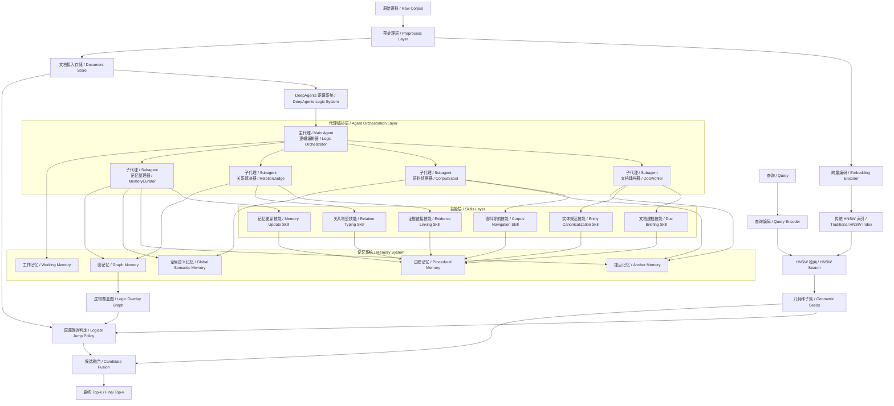
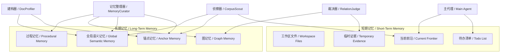
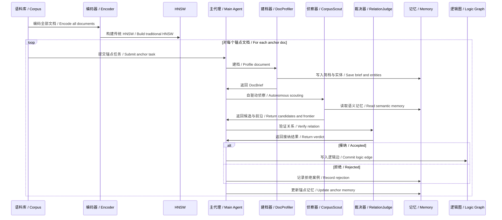
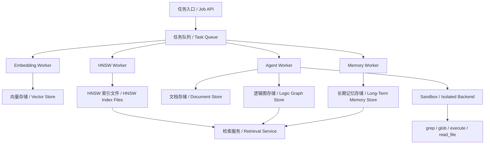

下面给你一版**可真实落地执行**的改进版 HNSW 架构设计。它严格保持一个核心边界：

**传统 HNSW 继续负责几何近邻检索；DeepAgents 系统负责自驱动建档、全局逻辑发现、结构化记忆维护与查询时的逻辑扩展。**

这样做的原因很直接：HNSW 原始优势来自分层近邻图、随机最高层分配和自顶向下搜索；deepagents 则天然提供规划、文件系统上下文、subagent、skills、长期记忆，以及在 sandbox/backend 条件下的 `grep`/`glob`/`execute` 等执行能力，适合承担“逻辑层”的复杂工作。([arXiv][1])

---

# 1. 目标与边界

## 1.1 目标

你要实现的不是“改写 HNSW 本体”，而是一个**双层检索系统**：

* **几何层 / Geometry Layer**
  标准 HNSW，负责高效 ANN 检索

* **逻辑层 / Logic Layer**
  基于 deepagents 的自驱动逻辑发现系统，负责：

  * 文档摘要生成
  * 实体/主题抽取与规范化
  * 全局语料浏览
  * 逻辑边发现与验证
  * 结构化记忆维护
  * 查询时的逻辑跳转判定

## 1.2 明确不改的部分

第一版建议固定这些变量：

* HNSW 层级生成机制不改
* HNSW 插入流程不改
* HNSW 邻居选择启发式不改
* HNSW `M / ef_construction / ef_search` 仍然是主参数
* 逻辑边不直接注入 HNSW 内部图结构
* 查询仍然先走 HNSW，再做逻辑扩展

这能保证实验变量清晰，工程复杂度也可控。

---

# 2. 总体架构

## 2.1 总览图



---

# 3. 系统分层设计

## 3.1 离线构建层

负责把原始语料变成两类资产：

* **HNSW 几何索引**
* **逻辑覆盖图 + 结构化记忆**

核心任务：

1. 文档预处理
2. embedding 构建与 HNSW 建索引
3. deepagents 自驱动建档
4. 逻辑边发现与验证
5. memory 更新

## 3.2 在线检索层

负责真实查询执行：

1. query embedding
2. HNSW 初始召回
3. 从 top-B 几何种子出发读取逻辑边
4. 做 query-conditioned 跳转判定
5. 融合得分并输出 top-k

## 3.3 执行基础设施层

为了能“真实任务执行”，建议把 deepagents 放在**可隔离执行的 backend/sandbox**里。deepagents 文档说明：

* 有文件系统工具：`ls/read_file/write_file/edit_file/glob/grep`
* 使用 sandbox/backend 时可获得 `execute`
* 长期记忆可通过 `CompositeBackend` 把 `/memories/` 路径路由到持久存储
* subagent 用于上下文隔离，custom subagents 需要单独配置 skills。([LangChain 文档][2])

所以工程上建议：

* `StateBackend` / 工作线程态：短期任务文件
* `StoreBackend` / 持久态：长期记忆
* `CompositeBackend`：统一路由
* `sandbox backend`：允许 grep、shell、批处理脚本、轻型数据加工

---

# 4. 代理系统设计

## 4.1 主代理：LogicOrchestrator

职责：

* 接收锚点文档任务
* 生成关系假设
* 决定调用哪个 subagent
* 控制预算、停止条件与写边权限
* 汇总最终 discovery report

## 4.2 DocProfiler

职责：

* 读取原始文档
* 生成摘要
* 提取实体/关键词/主题/核心主张
* 产出 `DocBrief`

为什么单独做成 subagent：
deepagents 的 subagents 就是为上下文隔离和专项指令而设计的，适合把“高重复、高 token、高格式化”的文档建档工作隔离出去。([LangChain 文档][3])

## 4.3 CorpusScout

职责：

* 基于 `DocBrief` 和当前 hypothesis 做全局侦察
* 使用摘要搜索、实体搜索、grep、HNSW 邻居工具
* 维护 frontier
* 输出一批高价值候选

## 4.4 RelationJudge

职责：

* 对 `(anchor_doc, candidate_doc)` 做证据核验
* 输出：

  * accepted / rejected
  * relation_type
  * confidence
  * evidence spans
  * rationale

## 4.5 MemoryCurator

职责：

* 将本轮发现压缩成结构化记忆
* 更新锚点记忆、全局语义记忆、图记忆
* 维护别名表、失败模式表、关系模式表

---

# 5. Skills 设计

deepagents 的 skills 本质上是带 `SKILL.md` 的能力目录，可包含说明、脚本、模板与资产；系统按需展开，适合承载“过程规则”。([LangChain 文档][4])

建议 6 个核心 skills：

## 5.1 `doc_briefing`

输出规范：

* title
* abstract
* summary
* entities
* keywords
* claims
* relation hints

## 5.2 `entity_canonicalization`

规则：

* 实体别名合并
* 缩写扩展
* 大小写统一
* 同名歧义提示

## 5.3 `corpus_navigation`

规则：

* 何时先搜摘要
* 何时先查实体
* 何时使用 grep
* 何时参考 HNSW 邻居

## 5.4 `evidence_linking`

规则：

* 证据提取模板
* span 输出格式
* 引文/片段压缩格式

## 5.5 `relation_typing`

规则：

* `same_topic`
* `supporting_evidence`
* `comparison`
* `entity_bridge`

## 5.6 `memory_update`

规则：

* 哪些信息进长期记忆
* 哪些只放工作记忆
* 失败模式如何归档
* 历史边如何重验证

---

# 6. 记忆系统设计

## 6.1 五层记忆模型



## 6.2 每层保存什么

### 工作记忆 / Working Memory

线程态、临时：

* 当前锚点
* 当前 hypothesis
* 当前 frontier
* 临时搜索结果
* 当前待办

### 锚点记忆 / Anchor Memory

文档级长期记忆：

* 历史摘要
* 已接受边
* 已拒绝边
* 有效搜索 query
* 文档特有搜索习惯

### 全局语义记忆 / Global Semantic Memory

跨文档记忆：

* canonical entities
* aliases
* relation patterns
* topic phrases
* successful playbooks

### 图记忆 / Graph Memory

逻辑图本身：

* accepted edges
* confidence
* relation type
* evidence
* discovery path
* last validated timestamp

### 过程记忆 / Procedural Memory

由 skills 承载：

* 建档规范
* 证据抽取规范
* 判型规范
* memory 更新策略

## 6.3 推荐 backend 路由

利用 deepagents 的 `CompositeBackend`：

* `/workspace/` -> `StateBackend`
* `/memories/` -> `StoreBackend`

这样线程内过程文件短期存在，长期知识与逻辑图稳定持久化。([LangChain 文档][5])

---

# 7. 离线构建流程

## 7.1 流程图



## 7.2 关键细节

### 建档阶段

建议先由 `DocProfiler` 生成 `DocBrief`，避免主代理每次都读全文。

### 侦察阶段

侦察不是固定 pairwise，而是：

* summary search
* entity lookup
* grep over corpus surface
* optional HNSW-neighbor expand

### 裁决阶段

只在少量高价值候选上做局部验证，防止全局 pairwise 爆炸。

### 写边阶段

边结构必须至少含：

* `src_doc_id`
* `dst_doc_id`
* `relation_type`
* `confidence`
* `evidence`
* `discovery_path`
* `created_at`
* `last_validated_at`

---

# 8. 在线检索流程

## 8.1 流程图


## 8.2 跳转判定

一条逻辑边 `u -> v` 不是天然可跳，而是**query-conditioned** 的。

推荐跳转条件：

1. `u` 在 HNSW 前 `B` 个种子中
2. 边置信度 `c_e >= τ_c`
3. `query` 与“边语义卡片”的 embedding 余弦相似度 `I(q,e) >= τ_I`
4. `target doc` 本身和 query 有表面相关性 `Rel(q,v) >= τ_v`
5. 未超过扩展预算

边语义卡片示例：

```text
[REL=supporting_evidence]
[SRC_SUMMARY=...]
[DST_SUMMARY=...]
[EVIDENCE=...]
```

然后定义：

[
I(q,e)=\cos(Enc(q), Enc(T_e))
]

这相当于把你前面提的“query embedding 与逻辑边 embedding 余弦相似度”正式纳入跳转策略。

## 8.3 最终 top-k

最终候选池：

[
C(q)=S_H(q)\cup S_L(q)
]

统一打分：

[
Score(d|q)=\alpha \cdot Score_H(d|q)+\beta \cdot Score_L(d|q)
]

其中：

[
Score_L(d|q)=
\max_u \big(
Score_H(u|q)\cdot c_{u,d}\cdot I(q,e_{u,d})\cdot Rel(q,d)
\big)
]

然后排序取前 `k`。

---

# 9. 真实任务执行所需的运行架构

## 9.1 推荐任务流

为了真正跑起来，建议把“离线构图任务”做成可调度的 job 系统：

* `build_embeddings`
* `build_hnsw`
* `profile_docs`
* `discover_logic_edges`
* `validate_edges`
* `refresh_memory`
* `revalidate_edges`

## 9.2 执行架构图



## 9.3 推荐职责划分

### Agent Worker

负责：

* 启动 deepagent
* 配置 backend / skills / subagents
* 执行锚点探索任务
* 写入逻辑边和 memory

### Retrieval Service

负责：

* 加载 HNSW 索引
* 查询 embedding
* 读取逻辑图
* 执行 jump policy
* 输出 top-k

### Memory Worker

负责：

* 周期性压缩 memory
* 重新验证旧边
* 维护 canonical entities

---

# 10. 基本代码结构

下面这版结构已经足够支撑第一版实现。

```text
hnsw_logic_system/
├── README.md
├── pyproject.toml
├── configs/
│   ├── app.yaml
│   ├── hnsw.yaml
│   ├── agents.yaml
│   └── retrieval.yaml
├── data/
│   ├── raw/
│   ├── processed/
│   ├── indices/
│   ├── graph/
│   └── memories/
├── scripts/
│   ├── build_embeddings.py
│   ├── build_hnsw.py
│   ├── profile_docs.py
│   ├── discover_edges.py
│   ├── revalidate_edges.py
│   └── serve_retrieval.py
├── src/
│   └── hnsw_logic/
│       ├── __init__.py
│       ├── config/
│       │   ├── settings.py
│       │   └── schema.py
│       ├── core/
│       │   ├── types.py
│       │   ├── constants.py
│       │   └── utils.py
│       ├── embedding/
│       │   ├── encoder.py
│       │   └── batch_encode.py
│       ├── hnsw/
│       │   ├── index_builder.py
│       │   ├── searcher.py
│       │   └── storage.py
│       ├── docs/
│       │   ├── loader.py
│       │   ├── preprocessor.py
│       │   └── brief_store.py
│       ├── logic_graph/
│       │   ├── models.py
│       │   ├── store.py
│       │   ├── builder.py
│       │   └── revalidate.py
│       ├── memory/
│       │   ├── models.py
│       │   ├── working_memory.py
│       │   ├── anchor_memory.py
│       │   ├── semantic_memory.py
│       │   ├── graph_memory.py
│       │   └── curator.py
│       ├── agents/
│       │   ├── factory.py
│       │   ├── orchestrator.py
│       │   ├── subagents/
│       │   │   ├── doc_profiler.py
│       │   │   ├── corpus_scout.py
│       │   │   ├── relation_judge.py
│       │   │   └── memory_curator.py
│       │   ├── tools/
│       │   │   ├── search_summaries.py
│       │   │   ├── lookup_entities.py
│       │   │   ├── get_hnsw_neighbors.py
│       │   │   ├── read_doc_brief.py
│       │   │   ├── read_doc_full.py
│       │   │   └── commit_logic_edge.py
│       │   └── skills/
│       │       ├── doc_briefing/
│       │       │   └── SKILL.md
│       │       ├── entity_canonicalization/
│       │       │   └── SKILL.md
│       │       ├── corpus_navigation/
│       │       │   └── SKILL.md
│       │       ├── evidence_linking/
│       │       │   └── SKILL.md
│       │       ├── relation_typing/
│       │       │   └── SKILL.md
│       │       └── memory_update/
│       │           └── SKILL.md
│       ├── retrieval/
│       │   ├── query_encoder.py
│       │   ├── jump_policy.py
│       │   ├── candidate_fusion.py
│       │   ├── scorer.py
│       │   └── service.py
│       ├── jobs/
│       │   ├── tasks.py
│       │   ├── workers.py
│       │   └── scheduler.py
│       └── api/
│           ├── schemas.py
│           ├── routes_build.py
│           ├── routes_search.py
│           └── routes_admin.py
└── tests/
    ├── test_hnsw_search.py
    ├── test_doc_profiler.py
    ├── test_corpus_scout.py
    ├── test_relation_judge.py
    ├── test_jump_policy.py
    └── test_fusion.py
```

---

# 11. 核心数据结构

## 11.1 文档简档

```python
from dataclasses import dataclass, field
from typing import List, Dict, Optional

@dataclass
class DocBrief:
    doc_id: str
    title: str
    summary: str
    entities: List[str] = field(default_factory=list)
    keywords: List[str] = field(default_factory=list)
    claims: List[str] = field(default_factory=list)
    relation_hints: List[str] = field(default_factory=list)
    metadata: Dict[str, str] = field(default_factory=dict)
```

## 11.2 逻辑边

```python
from dataclasses import dataclass
from typing import List, Optional

@dataclass
class LogicEdge:
    src_doc_id: str
    dst_doc_id: str
    relation_type: str
    confidence: float
    evidence_spans: List[str]
    discovery_path: List[str]
    edge_card_text: str
    created_at: str
    last_validated_at: Optional[str] = None
```

## 11.3 记忆结构

```python
from dataclasses import dataclass, field
from typing import List, Dict

@dataclass
class AnchorMemory:
    anchor_doc_id: str
    explored_docs: List[str] = field(default_factory=list)
    rejected_docs: List[str] = field(default_factory=list)
    accepted_edge_ids: List[str] = field(default_factory=list)
    active_hypotheses: List[str] = field(default_factory=list)
    successful_queries: List[str] = field(default_factory=list)
    failed_queries: List[str] = field(default_factory=list)

@dataclass
class GlobalSemanticMemory:
    canonical_entities: Dict[str, str] = field(default_factory=dict)
    aliases: Dict[str, List[str]] = field(default_factory=dict)
    relation_patterns: Dict[str, List[str]] = field(default_factory=dict)
    rejection_patterns: Dict[str, List[str]] = field(default_factory=dict)
```

---

# 12. 核心接口骨架

## 12.1 Agent 工厂

```python
class AgentFactory:
    def create_orchestrator(self):
        ...

    def create_doc_profiler(self):
        ...

    def create_corpus_scout(self):
        ...

    def create_relation_judge(self):
        ...

    def create_memory_curator(self):
        ...
```

## 12.2 逻辑发现入口

```python
class LogicDiscoveryService:
    def __init__(self, orchestrator, graph_store, memory_store):
        self.orchestrator = orchestrator
        self.graph_store = graph_store
        self.memory_store = memory_store

    def discover_for_anchor(self, doc_id: str) -> list[LogicEdge]:
        """
        1. 读取 anchor 文档
        2. 调用主代理生成计划
        3. 委派建档、侦察、裁决
        4. 写入图和 memory
        """
        ...
```

## 12.3 跳转策略

```python
class JumpPolicy:
    def __init__(self, tau_conf: float, tau_edge: float, tau_target: float,
                 max_seeds: int, max_expansions_per_seed: int):
        self.tau_conf = tau_conf
        self.tau_edge = tau_edge
        self.tau_target = tau_target
        self.max_seeds = max_seeds
        self.max_expansions_per_seed = max_expansions_per_seed

    def allow_jump(self, query_emb, seed_score, edge: LogicEdge, target_rel_score: float) -> bool:
        edge_match = cosine(query_emb, embed_text(edge.edge_card_text))
        if edge.confidence < self.tau_conf:
            return False
        if edge_match < self.tau_edge:
            return False
        if target_rel_score < self.tau_target:
            return False
        return True
```

## 12.4 检索服务

```python
class HybridRetrievalService:
    def __init__(self, hnsw_searcher, graph_store, jump_policy, scorer):
        self.hnsw_searcher = hnsw_searcher
        self.graph_store = graph_store
        self.jump_policy = jump_policy
        self.scorer = scorer

    def search(self, query: str, top_k: int = 10):
        query_emb = self.scorer.encode_query(query)
        seeds = self.hnsw_searcher.search(query_emb, top_k=50)
        expanded = []

        for seed in seeds[: self.jump_policy.max_seeds]:
            edges = self.graph_store.get_out_edges(seed.doc_id)
            for edge in edges[: self.jump_policy.max_expansions_per_seed]:
                target_rel = self.scorer.score_target(query_emb, edge.dst_doc_id)
                if self.jump_policy.allow_jump(query_emb, seed.score, edge, target_rel):
                    expanded.append((edge.dst_doc_id, seed.score, edge, target_rel))

        return self.scorer.rank(query_emb, seeds, expanded, top_k=top_k)
```

---

# 13. 配置建议

## 13.1 `hnsw.yaml`

```yaml
m: 32
ef_construction: 200
ef_search: 64
vector_dim: 1024
metric: cosine
```

## 13.2 `agents.yaml`

```yaml
sandbox_enabled: true
workspace_root: /workspace
memories_root: /memories

subagents:
  doc_profiler:
    enabled: true
    skills:
      - doc_briefing
      - entity_canonicalization
  corpus_scout:
    enabled: true
    skills:
      - corpus_navigation
  relation_judge:
    enabled: true
    skills:
      - evidence_linking
      - relation_typing
  memory_curator:
    enabled: true
    skills:
      - memory_update
```

## 13.3 `retrieval.yaml`

```yaml
initial_top_k: 50
seed_top_b: 5
max_expansions_per_seed: 2

jump_policy:
  tau_conf: 0.80
  tau_edge: 0.55
  tau_target: 0.45

fusion:
  alpha: 1.0
  beta: 0.6
```

---

# 14. 真实落地时最需要注意的细节

## 14.1 不要让主代理直接吃全文

主代理只看：

* `DocBrief`
* frontier 摘要
* memory 摘要
* 子代理压缩报告

全文、grep 输出、长证据片段放文件系统，由子代理读取。

这和 deepagents 的 context compression / filesystem offloading 设计是吻合的。([LangChain 文档][6])

## 14.2 自驱动探索一定要有预算

建议固定：

* `MAX_STEPS_PER_ANCHOR`
* `MAX_FULL_DOC_READS`
* `MAX_EDGES_PER_ANCHOR`
* `MAX_FRONTIER_WIDTH`

否则 agent 容易失控式全库漫游。

## 14.3 逻辑边必须可重验证

给每条边加：

* `last_validated_at`
* `validation_count`
* `rejected_after_refresh`

这样后续增量更新时不会把陈旧逻辑边永久保留。

## 14.4 first version 不做二跳

在线检索只允许一跳：

* 更稳
* 更快
* 更好解释
* 更方便做消融

---

# 15. 最小可执行实施顺序

## Phase 1：先跑通底座

* 文档预处理
* embedding
* HNSW 建索引
* 检索 API

## Phase 2：跑通离线逻辑层

* `DocProfiler`
* `CorpusScout`
* `RelationJudge`
* `LogicEdge` 存储

## Phase 3：接入 memory

* `AnchorMemory`
* `GlobalSemanticMemory`
* `MemoryCurator`

## Phase 4：接入在线逻辑扩展

* `JumpPolicy`
* `HybridRetrievalService`
* 融合排序

## Phase 5：任务化与运维

* 队列
* worker
* revalidate jobs
* admin API

---

# 16. 这套架构的最简定位

你这套系统可以用一句话概括：

**它不是“用 agent 替代 HNSW”，而是“在标准 HNSW 上方增加一个能自驱动建档、发现、验证、记忆和跳转的逻辑覆盖层”。**

下一步最值得做的是把上面的代码骨架收束成 3 个可直接开工的文件：`logic_graph/models.py`、`agents/orchestrator.py`、`retrieval/jump_policy.py`。

[1]: https://arxiv.org/abs/1603.09320?utm_source=chatgpt.com "Efficient and robust approximate nearest neighbor search using Hierarchical Navigable Small World graphs"
[2]: https://docs.langchain.com/oss/javascript/deepagents/backends?utm_source=chatgpt.com "Backends - Docs by LangChain"
[3]: https://docs.langchain.com/oss/python/deepagents/subagents?utm_source=chatgpt.com "Subagents - Docs by LangChain"
[4]: https://docs.langchain.com/oss/javascript/deepagents/skills?utm_source=chatgpt.com "Skills - Docs by LangChain"
[5]: https://docs.langchain.com/oss/python/deepagents/long-term-memory?utm_source=chatgpt.com "Long-term memory - Docs by LangChain"
[6]: https://docs.langchain.com/oss/python/deepagents/harness?utm_source=chatgpt.com "Harness capabilities - Docs by LangChain"
