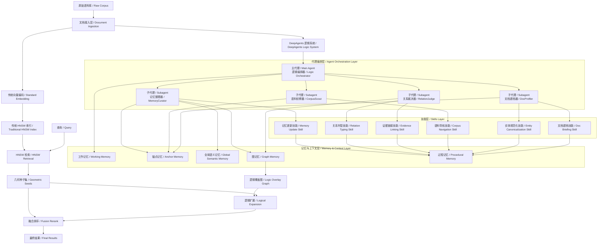
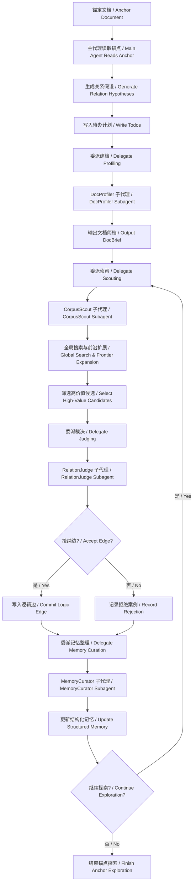
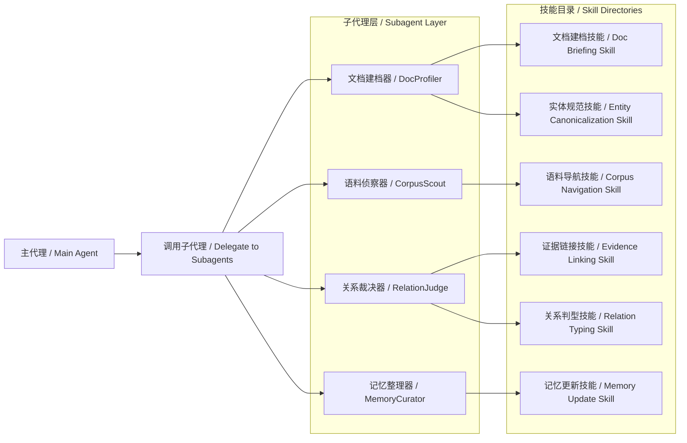
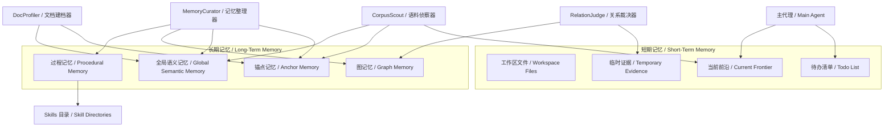
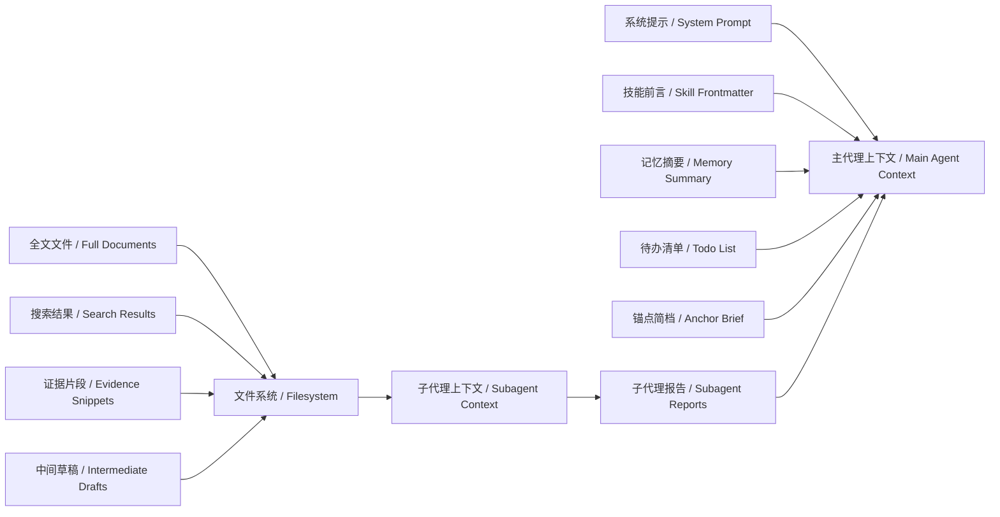
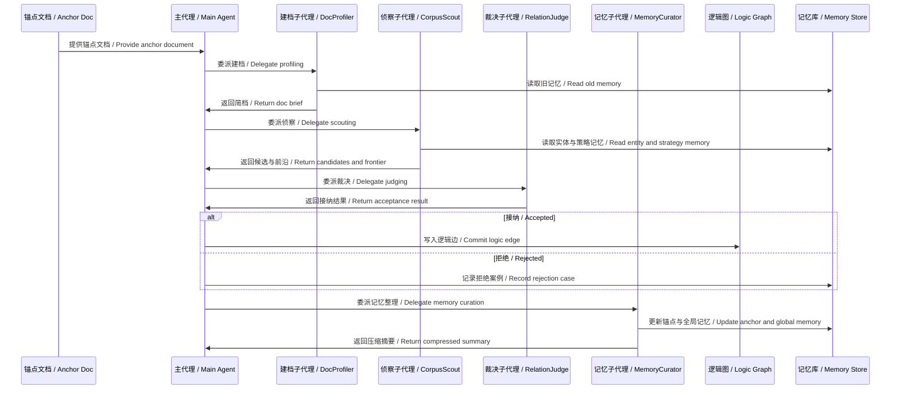

可以。我先给出明确结论：

**我建议采用“主代理 + 专业 subagent + skills + 分层 memory”的混合架构。**
其中，**摘要生成与实体提取不直接放在主代理里硬做，也不只做成被动 skills**；更合适的是：

* **主代理**负责自驱动规划、全局探索、关系假设与写边决策；
* **专用 subagent**负责高重复、高上下文污染的任务，例如文档摘要、实体抽取、证据核验；
* **skills**负责把这些重复任务的规则、模板、字段规范、判定准则固化下来，按需加载；
* **memory**不再只是“记点笔记”，而是做成结构化的逻辑增强底座。

这样选的原因很直接：deepagents 本身就适合做规划、文件系统上下文管理、subagent 委派和长时记忆；subagent 的主要价值是隔离上下文污染，skills 的主要价值是把专门工作流做成可复用、按需披露的能力。([LangChain 文档][1])

---

# 一、核心设计取舍

## 1.1 为什么不用“主代理内联完成摘要/实体抽取”

不建议让主代理自己把“读文档 → 摘要 → 实体 → 关系假设 → 全局搜索 → 证据验证 → 记忆更新”全部串在一个上下文里。原因是摘要和实体抽取会产生大量中间结果，而 deepagents 的 subagent 机制正是为**上下文隔离**和**专项任务委派**设计的：主代理发出任务后，子代理在自己的上下文里完成多步工作，最后只返回压缩后的结果。([LangChain 文档][2])

## 1.2 为什么也不用“纯 skills”

也不建议把摘要和实体提取“仅仅”做成 skills。因为 skills 在 deepagents 里本质上是**带 `SKILL.md` 的能力包**，包含说明、脚本、参考资料和模板；系统会先读 frontmatter，再在需要时按**progressive disclosure**方式展开更多内容。它很适合承载规则、模板和资产，但并不天然替代“上下文隔离执行器”。([LangChain 文档][3])

## 1.3 我的选择

所以最合适的是：

**“subagent 负责执行，skills 负责规范，主代理负责编排。”**

也就是：

* `DocProfiler` 子代理：做摘要、实体、关键词、主张抽取
* `CorpusScout` 子代理：做全局搜索与 frontier 扩展
* `RelationJudge` 子代理：做关系验证与 typed edge 输出
* `MemoryCurator` 子代理：做记忆压缩、更新和索引维护
* 主代理 `LogicOrchestrator`：负责整体自驱动探索

---

# 二、完整系统定位

这套系统的边界仍然保持非常清晰：

* **传统 HNSW**：完全不改，仍然只做几何近邻检索
* **DeepAgents 系统**：围绕原始文本，自驱动生成摘要、实体、搜索计划、关系边与记忆
* **Logic Overlay Graph**：sidecar 逻辑图，独立于 HNSW
* **Query-time**：先 HNSW，再逻辑边受控扩展

所以你可以把整套方法命名为：

**HNSW + DeepAgents Autonomous Logic Overlay**
或者中文更直白一点：

**基于 DeepAgents 自驱动逻辑覆盖图的 HNSW 增强检索系统**

---

# 三、总体架构图



---

# 四、Agent 系统的正式分工

## 4.1 主代理：LogicOrchestrator

主代理只做四件事：

1. 选择当前锚定文档
2. 生成关系假设与搜索计划
3. 决定调用哪个 subagent
4. 决定何时写边、何时终止

它不直接承担大规模阅读与重计算任务。
这样主代理的上下文始终保持“轻而策略化”。

---

## 4.2 DocProfiler：文档建档子代理

这是你提出的第一项增强：**摘要生成与实体提取由 agent 系统完成**。
我建议明确放到这个子代理里。

它的输入是原始文档及少量元信息，输出是结构化 `DocBrief`：

* 标题
* 摘要
* 实体集合
* 关键词集合
* 核心主张
* 潜在关系线索
* 初始搜索 query 建议

### 为什么放在这里

因为这一步是高频重复任务，且输出会非常标准化，特别适合：

* 由 subagent 做隔离执行
* 由 `Doc Briefing Skill` 和 `Entity Canonicalization Skill` 约束输出格式

---

## 4.3 CorpusScout：语料侦察子代理

它不是“拿外部候选对来判别”，而是：

* 读取锚点 brief
* 根据当前 hypothesis 自主调用工具
* 在摘要层、实体层、grep 层、几何邻居层之间切换
* 扩展 frontier

这就是你希望的“agent 自驱动发现”。

---

## 4.4 RelationJudge：关系裁决子代理

它负责把“发现了疑似目标文档”这件事收敛成正式逻辑边：

* 回读锚文档关键证据
* 回读目标文档关键证据
* 判断是否应接纳
* 给出关系类型、置信度、证据和理由

---

## 4.5 MemoryCurator：记忆整理子代理

这是你提出的第二项增强：**memory 不能只是零散笔记，要真正辅助逻辑增强。**

所以我建议单独设一个记忆整理子代理，职责是：

* 将本轮探索的有效发现压缩成结构化记忆
* 更新实体别名表、关系模式表、失败搜索记录
* 为后续 anchor 提供全局先验

---

# 五、Agent 自驱动编排图



这套编排和 deepagents 的官方能力是对齐的：主代理具备规划能力与 `write_todos`，subagent 用于上下文隔离与专项任务，文件系统可承载中间状态与记忆。([LangChain 文档][4])

---

# 六、Skills 编排方案

## 6.1 Skills 的角色定位

在这套系统里，skills 不是“一个个独立 agent”，而是**给 agent/subagent 提供可按需加载的专门工作流规范**。deepagents 的官方技能机制就是目录化能力包，包含 `SKILL.md` 和可选脚本、资料、模板，并采用 progressive disclosure 方式按需展开。([LangChain 文档][3])

## 6.2 我建议的六类技能

### Skill 1：文档建档技能 / Doc Briefing Skill

规范输出：

* 摘要字段
* 主体字段
* 主张字段
* 搜索线索字段

### Skill 2：实体规范化技能 / Entity Canonicalization Skill

规范：

* 实体别名合并
* 缩写扩展
* 拼写统一
* 同名消歧提示

### Skill 3：语料导航技能 / Corpus Navigation Skill

规范：

* 什么时候先搜摘要
* 什么时候先查实体
* 什么时候调用 grep
* 什么时候参考 HNSW 邻居

### Skill 4：证据链接技能 / Evidence Linking Skill

规范：

* 怎样从文本中抽证据
* 怎样标注 span
* 怎样压缩证据说明

### Skill 5：关系判型技能 / Relation Typing Skill

规范：

* `same_topic`
* `supporting_evidence`
* `comparison`
* `entity_bridge`

### Skill 6：记忆更新技能 / Memory Update Skill

规范：

* 什么写入持久记忆
* 什么只保留在线程态
* 失败案例怎样归档
* 何时做压缩与剪枝

---

## 6.3 Skills 作用图



---

# 七、Memory 系统的正式设计

这里我会把 memory 做得更系统，不再只是“有个 /memories 目录”。

## 7.1 设计原则

### 原则一：结构化优先

memory 的 source of truth 不能是自由文本。
自由文本只作为解释层，真正被系统消费的应是结构化记录。

### 原则二：短期与长期分层

deepagents 官方支持两类文件系统：

* 线程态、短期、易失的 `StateBackend`
* 通过 `CompositeBackend` 路由到持久存储的长期 memory，常见是 `/memories/` 路径前缀([LangChain 文档][5])

### 原则三：memory 服务于逻辑增强

memory 不是为了“更像聊天机器人”，而是为了：

* 减少重复搜索
* 规范实体
* 累积关系模板
* 提高后续逻辑发现质量

---

## 7.2 五层记忆模型

### 1）工作记忆 / Working Memory

线程级、易失、放在 `/workspace/` 或普通状态文件中。

保存：

* 当前锚点
* 当前 hypothesis
* frontier
* todo
* 本轮临时证据

### 2）锚点记忆 / Anchor Memory

面向单个文档、长期保存。

保存：

* 该文档的历史摘要版本
* 已接纳的外连边
* 已拒绝的候选边
* 历史有效搜索 query
* 高频关系类型

### 3）全局语义记忆 / Global Semantic Memory

面向全语料的稳定知识。

保存：

* 实体规范化表
* 实体别名表
* 主题短语表
* 跨文档关系模式模板
* 高价值搜索 playbook

### 4）图记忆 / Graph Memory

保存逻辑图本身及其 provenance。

保存：

* accepted edges
* relation type
* confidence
* evidence span
* discovery path
* last validated time

### 5）过程记忆 / Procedural Memory

实质上由 skills 承载。

保存：

* 抽取规则
* 判型规则
* 证据模板
* 更新策略

所以在你的系统里，**skills 本身就是过程记忆的一部分**。

---

## 7.3 Memory 架构图



---

## 7.4 Memory 如何实际辅助逻辑增强

这是最关键的一点。
我建议让 memory 通过四种方式直接影响逻辑发现。

### 方式一：实体标准化先验

如果历史上已经学会：

* “LLM” 和 “large language model” 应合并
* 某个人名有多种写法
* 某领域术语有缩写/全称

那么后续侦察时就不必从零开始猜。

### 方式二：搜索策略复用

如果历史上对某类文档，“先查摘要中的方法词，再 grep 数据集名”最有效，那么这个模式应被写入全局语义记忆或过程记忆。

### 方式三：拒绝案例抑制

如果某类实体桥接经常产生伪相关，就应把它记入失败模式，降低再次尝试优先级。

### 方式四：边验证再利用

如果某 relation type 在某语域中常见，则后续裁决可带着先验进入，而不是完全零样本。

---

# 八、上下文管理方案

deepagents 官方文档明确说明，agent 的输入上下文由多个部分组成，包括自定义系统提示、内置基座提示、todo 提示、memory 提示、skills 提示、虚拟文件系统提示以及 subagent 提示。([LangChain 文档][4])

所以你的系统要主动做**上下文工程**，而不是把所有内容硬塞给主模型。

## 8.1 主代理上下文应该只包含

* 当前锚点 brief
* 当前轮的 hypothesis 摘要
* frontier 摘要
* memory 的压缩摘要
* todo
* 子代理返回的最终报告

## 8.2 不应直接塞入主代理的内容

* 大段全文
* 大规模 grep 结果
* 多轮原始搜索日志
* 子代理的完整中间推理

这些应放入文件系统，由子代理读写，主代理只接收压缩结果。
这也符合 deepagents 的上下文压缩与文件系统 offloading 设计。([LangChain 文档][4])

---

## 8.3 上下文流转图



---

# 九、推荐的目录与存储路径

既然你要把 memory 做系统化，我建议路径也结构化。

deepagents 的长期记忆可通过 `CompositeBackend` 将特定路径路由到持久存储，典型做法就是把 `/memories/` 路径持久化，而线程内工作文件仍留在瞬态状态里。([LangChain 文档][5])

推荐路径：

```text
/workspace/
  runs/
    {run_id}/
      todo.json
      frontier.json
      candidate_cache.json
      evidence_cache.json
  anchors/
    {doc_id}/
      current_brief.json
      scout_notes.md
      judge_report.json

/memories/
  anchor_memory/
    {doc_id}.json
  doc_briefs/
    {doc_id}.json
  entity_memory/
    canonical_entities.json
    aliases.json
  relation_memory/
    relation_patterns.json
    rejection_patterns.json
  graph_memory/
    accepted_edges.jsonl
    edge_stats.json
  procedural_memory/
    search_playbooks.md
    judging_rules.md
```

---

# 十、工具层设计

deepagents 的虚拟文件系统工具通常包括 `ls`、`read_file`、`write_file`、`edit_file`、`glob`、`grep`，而 `execute` 只在支持 shell/sandbox 的后端下可用。([LangChain 文档][4])

在你的系统中，我建议工具分两层：

## 10.1 基础工具

直接沿用 deepagents filesystem：

* `read_file`
* `write_file`
* `edit_file`
* `glob`
* `grep`

## 10.2 研究型高层工具

再封装你自己的业务工具：

* `search_summaries(query, topn)`
* `lookup_entities(entities, topn)`
* `get_hnsw_neighbors(doc_id, k)`
* `read_doc_brief(doc_id)`
* `read_doc_full(doc_id)`
* `commit_logic_edge(...)`
* `load_anchor_memory(doc_id)`
* `update_global_memory(...)`

这样主代理就不会被迫只用 grep“裸奔”。

---

# 十一、完整的执行闭环



---

# 十二、我给你的最终推荐版本

如果你现在就要定稿方案，我建议你正式采用下面这个版本：

## 推荐架构名

**主代理自驱动 + 专用 subagent 执行 + skills 过程约束 + 分层结构化记忆**

## 三条关键原则

### 第一条

**摘要生成与实体提取归入 DocProfiler 子代理**
不是主代理内联，也不是纯 skills。

### 第二条

**memory 做成五层：工作、锚点、全局语义、图、过程**
其中过程记忆由 skills 承载，图记忆是逻辑增强的最终可用资产。

### 第三条

**主代理永远只看压缩后的必要上下文**
详细搜索、全文阅读、证据定位全部放到子代理和文件系统中。

---

# 十三、简化成一句话

你这套系统最准确的描述是：

**传统 HNSW 负责几何检索，DeepAgents 负责围绕锚点文档进行自驱动建档、全局侦察、关系裁决与记忆更新，最终生成并维护一张逻辑覆盖图。**

下一步最合适的是，我可以直接把这套内容进一步整理成**论文 Method 章节版**，写成更正式的小节结构，例如：
“Agentic Document Profiling”、“Autonomous Corpus Scouting”、“Structured Memory for Logical Augmentation”、“Hybrid Retrieval with Logic Overlay”。

[1]: https://docs.langchain.com/oss/python/deepagents/overview "Deep Agents overview - Docs by LangChain"
[2]: https://docs.langchain.com/oss/python/deepagents/subagents "Subagents - Docs by LangChain"
[3]: https://docs.langchain.com/oss/python/deepagents/skills "Skills - Docs by LangChain"
[4]: https://docs.langchain.com/oss/python/deepagents/harness "Harness capabilities - Docs by LangChain"
[5]: https://docs.langchain.com/oss/javascript/deepagents/long-term-memory "Long-term memory - Docs by LangChain"
