# Agent Runtime Guide

## 1. Scope

This document explains the real agent runtime of `gl-hnsw` as implemented today.
It focuses on the offline indexing phase, because the project keeps agents out of the online query path by default.

The main goals of this document are:

- explain how the main orchestrator and subagents collaborate
- explain how context is passed between phases
- explain how memory is updated and persisted
- explain the concrete loop structure used during offline indexing
- explain how capabilities, tools, and skills are attached to agents
- show the implementation with bilingual Mermaid diagrams

---

## 2. Design Positioning

The system is `agent-centric` in the offline indexing stage, not in online serving.

- Offline stage:
  - agents profile documents
  - agents scout candidate links
  - agents judge relations
  - agents review edge utility and risk
  - agents curate memory after each anchor pass
- Online stage:
  - no agent call by default
  - retrieval uses HNSW, sparse supplement, stored graph, and local scoring only

This split is intentional:

- offline agent execution can be slower but richer
- online retrieval must remain deterministic, cheap, and observable

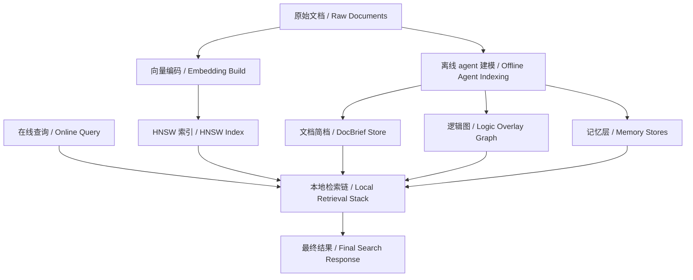

---

## 3. Runtime Topology

The actual runtime assembly is created in [bootstrap.py](/Users/armstrong/gl-hnsw/src/hnsw_logic/services/bootstrap.py).

The important objects are:

- `AgentFactory`
- `LogicOrchestrator`
- `LogicDiscoveryService`
- `BuildPipeline`
- `MemoryCuratorService`
- `HybridRetrievalService`

The runtime relationship is:

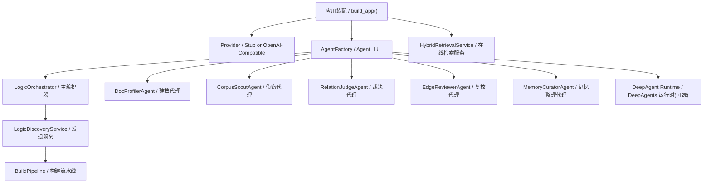

### Important implementation note

The repository prepares a `deepagents` runtime through `AgentFactory.try_create_deep_agent()`, but the main production path does not depend on the deepagents loop for every step.

The dominant execution path is:

- `LogicOrchestrator`
- typed subagent wrappers
- provider methods such as:
  - `profile_docs`
  - `propose_candidates`
  - `judge_relations_with_signals`
  - `review_relations_with_signals`
  - `curate_memory`

So the runtime is best described as:

- `deepagents-capable`
- but currently implemented as an explicit orchestrator pipeline with typed agent roles

---

## 4. Agent Roles

The configured subagents live in [agents.yaml](/Users/armstrong/gl-hnsw/configs/agents.yaml).

### 4.1 Main agent

The main agent is `LogicOrchestrator`, implemented in [orchestrator.py](/Users/armstrong/gl-hnsw/src/hnsw_logic/agents/orchestrator.py).

Responsibilities:

- coordinate the offline indexing phases
- compute local signals and heuristics
- call subagents in a fixed sequence
- rank anchors and candidates
- convert judged results into final `LogicEdge` objects
- decide whether discovery should be attempted for an anchor

### 4.2 Subagents

The system currently defines these subagents:

- `DocProfilerAgent`
  - wraps `provider.profile_doc()` and `provider.profile_docs()`
- `CorpusScoutAgent`
  - wraps `provider.propose_candidates()`
- `RelationJudgeAgent`
  - wraps relation judgment with or without local signals
- `EdgeReviewerAgent`
  - wraps second-pass review with utility and risk signals
- `MemoryCuratorAgent`
  - wraps `provider.curate_memory()`

There is also a `QueryStrategyAgent` implementation, but it is not part of the default online serving path now.

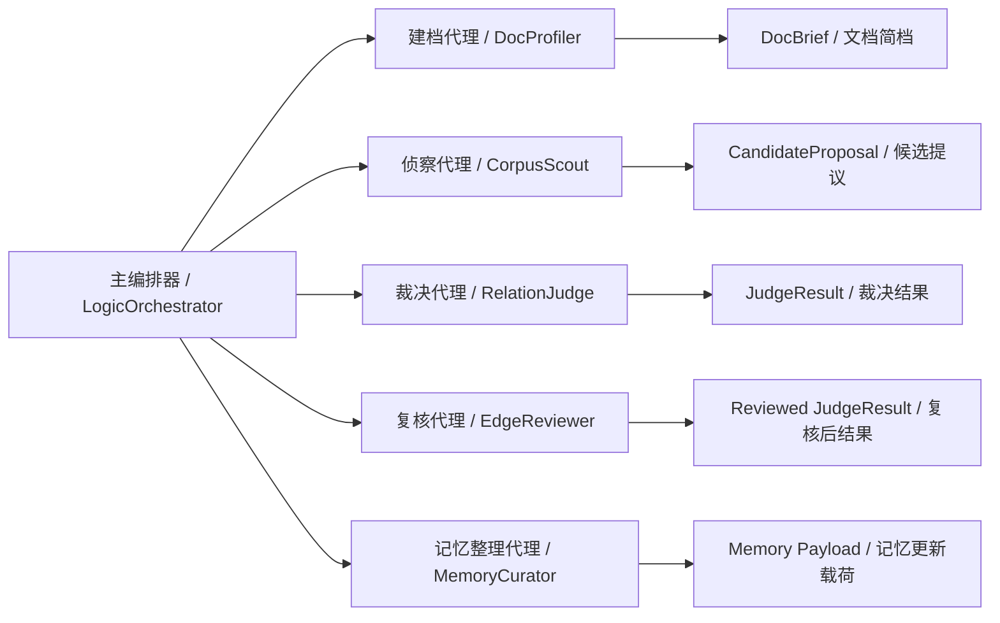

---

## 5. Context Model

The main context objects are defined in [models.py](/Users/armstrong/gl-hnsw/src/hnsw_logic/core/models.py).

### 5.1 Primary payload types

- `DocRecord`
  - normalized full document
- `DocBrief`
  - condensed agent-facing representation
- `CandidateProposal`
  - scout output
- `JudgeSignals`
  - local grounded evidence bundle
- `JudgeResult`
  - model-side verdict and utility signal
- `LogicEdge`
  - persisted graph edge
- `AnchorMemory`
  - per-anchor memory
- `GlobalSemanticMemory`
  - corpus-level reusable memory

### 5.2 Why two context layers exist

The system deliberately separates:

- `semantic context`
  - summary, claims, entities, relation hints
- `grounded local signals`
  - dense score, sparse score, mention score, direction score, risk flags, utility score

This separation is what keeps the system agent-centric but not prompt-only.

The agent does not operate from raw text intuition alone.
It also receives structured local evidence computed by the orchestrator.

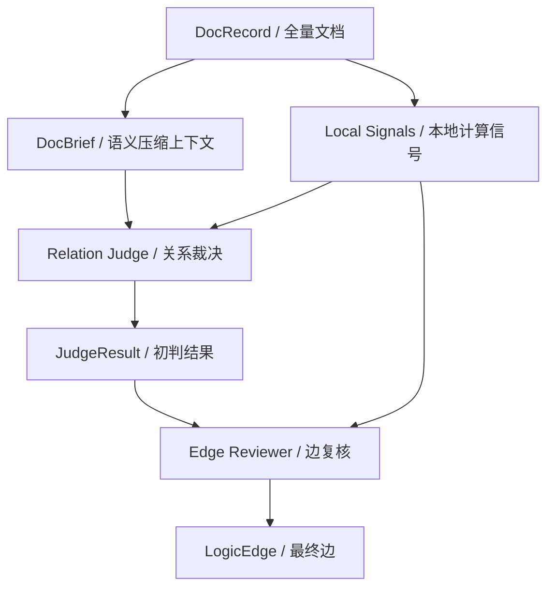

---

## 6. Offline Agent Loop

The true offline loop is split between:

- [pipeline.py](/Users/armstrong/gl-hnsw/src/hnsw_logic/services/pipeline.py)
- [discovery.py](/Users/armstrong/gl-hnsw/src/hnsw_logic/services/discovery.py)
- [orchestrator.py](/Users/armstrong/gl-hnsw/src/hnsw_logic/agents/orchestrator.py)

### 6.1 Pipeline stages

`BuildPipeline` runs the offline path in this order:

1. `build_embeddings`
2. `build_hnsw`
3. `profile_docs`
4. `discover_edges`
5. `revalidate_edges`

Only stages `3` and `4` are agent-heavy.

### 6.2 Per-anchor discovery loop

For each selected anchor:

1. load anchor `DocBrief`
2. scout candidate documents
3. compute local metrics and signal bundles
4. judge candidate relations
5. review judged candidates
6. build final accepted edges
7. write graph edges
8. update anchor memory and semantic memory

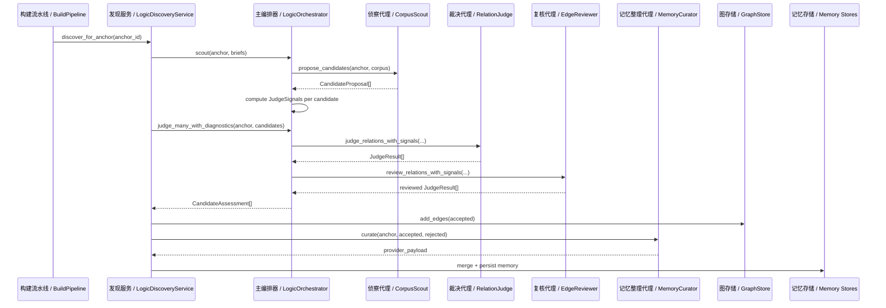

### 6.3 Retry logic

There is a controlled retry path in [discovery.py](/Users/armstrong/gl-hnsw/src/hnsw_logic/services/discovery.py):

- only for live providers
- only when no accepted edges were produced
- only for anchors above a priority threshold
- retry uses an expanded scout pass

This is not a free-running agent loop.
It is a bounded second pass under orchestrator control.

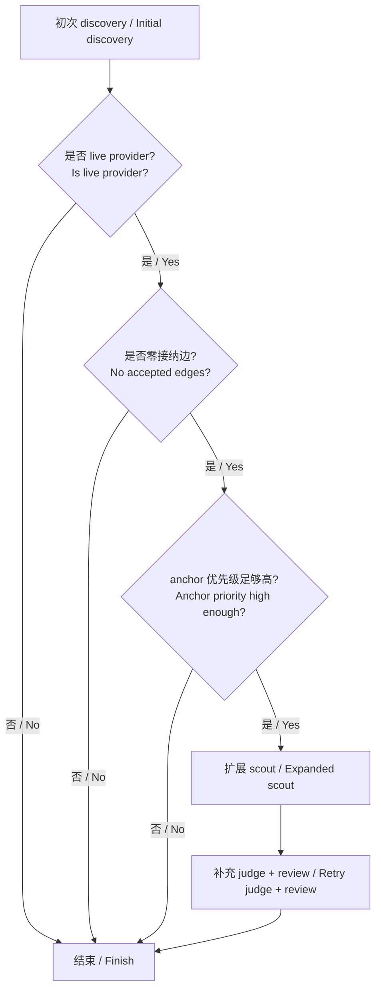

---

## 7. Main Agent to Subagent Call Semantics

### 7.1 The orchestrator is not passive

The orchestrator is not just a router.
It does substantial pre- and post-processing:

- caching embeddings
- deriving surrogate query terms
- computing bridge information gain
- computing duplicate penalties
- assembling `JudgeSignals`
- ranking discovery anchors
- selecting which candidates are allowed into judge/reviewer

This means:

- subagents are specialized decision-makers
- the orchestrator is the global controller and evidence builder

### 7.2 Call graph

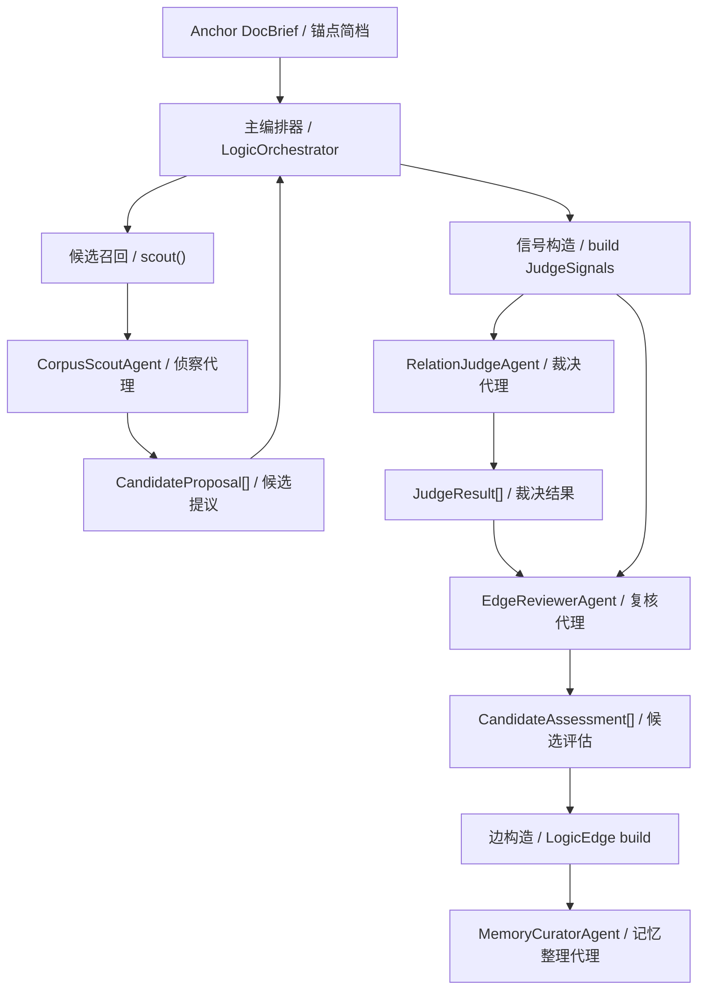

---

## 8. Context Passing Rules

The project does not pass one giant mutable conversation transcript.
Instead, it passes structured context between explicit stages.

### 8.1 Profile stage context

Input:

- `DocRecord`

Output:

- `DocBrief`

### 8.2 Scout stage context

Input:

- anchor `DocBrief`
- full corpus of `DocBrief`

Output:

- `CandidateProposal[]`

### 8.3 Judge stage context

Input:

- anchor `DocBrief`
- candidate `DocBrief`
- `JudgeSignals`

Output:

- `JudgeResult`

### 8.4 Review stage context

Input:

- anchor `DocBrief`
- candidate `DocBrief`
- `JudgeSignals`
- initial `JudgeResult`

Output:

- reviewed `JudgeResult`

### 8.5 Curate stage context

Input:

- anchor `DocBrief`
- accepted `LogicEdge[]`
- rejected doc ids

Output:

- provider payload for memory merge

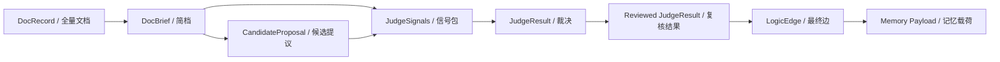

---

## 9. Memory Management

Memory is file-backed and explicitly merged, not agent-hidden.

The memory stores are:

- [anchor_memory.py](/Users/armstrong/gl-hnsw/src/hnsw_logic/memory/anchor_memory.py)
- [semantic_memory.py](/Users/armstrong/gl-hnsw/src/hnsw_logic/memory/semantic_memory.py)
- [graph_memory.py](/Users/armstrong/gl-hnsw/src/hnsw_logic/memory/graph_memory.py)
- [curator.py](/Users/armstrong/gl-hnsw/src/hnsw_logic/memory/curator.py)

### 9.1 Anchor memory

Anchor memory stores per-anchor operational state:

- explored docs
- rejected docs
- accepted edge ids
- active hypotheses
- successful and failed search patterns
- rejection reasons
- candidate scores
- accepted edge scores

### 9.2 Global semantic memory

Global semantic memory stores reusable corpus-level patterns:

- canonical entities
- aliases
- relation patterns
- rejection patterns

### 9.3 Graph memory

Graph memory stores graph-level stats:

- accepted edge count
- last revalidation time

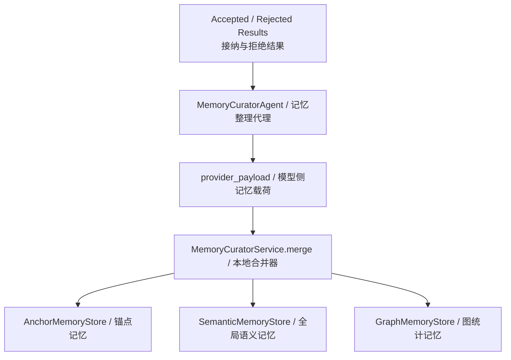

### 9.4 Why memory is split

The split avoids mixing different timescales:

- anchor memory:
  - local, per-document, operational
- semantic memory:
  - corpus-level reusable abstraction
- graph memory:
  - system-level monitoring state

This is a practical replacement for letting an opaque agent conversation history accumulate forever.

---

## 10. Agent Loop Implementation Logic

The agent loop is implemented as a bounded deterministic controller around model calls.

### 10.1 Loop structure

For each anchor:

1. compute whether the anchor is eligible for discovery
2. scout candidates
3. build feature bundles
4. judge candidates
5. review candidates
6. accept top utility edges
7. write graph
8. update memory
9. optionally retry once

### 10.2 Why this is still an agent loop

It is an agent loop because:

- specialized roles exist
- different roles operate on different subproblems
- role-specific skills guide their behavior
- the provider may use remote reasoning for each role
- outputs from one role become context for the next role

It is not an open-ended autonomous loop because:

- maximum passes are bounded
- graph writes happen through explicit gating
- memory writes happen through explicit merge logic
- the orchestrator owns final control

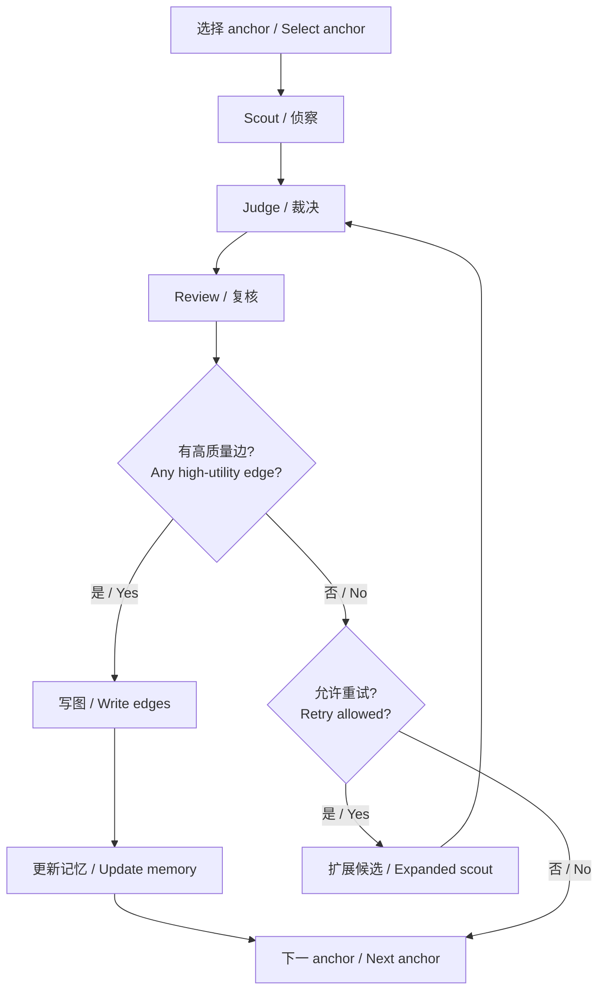

---

## 11. Capability Management

Capabilities are distributed across three layers:

- provider capabilities
- tool capabilities
- skill capabilities

### 11.1 Provider capabilities

The provider is the true execution backend for subagent reasoning.

Examples:

- `profile_doc`
- `propose_candidates`
- `judge_relation_with_signals`
- `review_relation_with_signals`
- `curate_memory`

So the provider owns:

- remote reasoning access
- structured output generation
- embedding calls
- live reasoning toggles

### 11.2 Tool capabilities

The tool registry is defined in [registry.py](/Users/armstrong/gl-hnsw/src/hnsw_logic/agents/tools/registry.py).

Available tools:

- `search_summaries`
- `lookup_entities`
- `get_hnsw_neighbors`
- `read_doc_brief`
- `read_doc_full`
- `commit_logic_edge`
- `load_anchor_memory`
- `update_global_memory`

These are the environment-facing abilities available to a deepagent runtime.

### 11.3 Skill capabilities

Skills are stored under [agents/skills](/Users/armstrong/gl-hnsw/src/hnsw_logic/agents/skills).

Configured skill mapping:

- `doc_profiler`
  - `doc_briefing`
  - `entity_canonicalization`
- `corpus_scout`
  - `corpus_navigation`
- `relation_judge`
  - `evidence_linking`
  - `relation_typing`
- `edge_reviewer`
  - `edge_utility`
  - `signal_fusion`
- `memory_curator`
  - `memory_update`

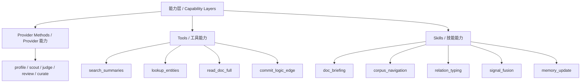

---

## 12. Skills Mechanism

The `skills` mechanism is prompt-level capability shaping, not executable business logic.

### 12.1 What skills do

Skills tell each role:

- what output shape to prefer
- what evidence to prioritize
- when to abstain
- what kind of mistakes to avoid

Examples:

- `edge_utility`
  - prefer retrieval-useful edges over topical similarity
- `signal_fusion`
  - treat local signals as grounded evidence
- `relation_typing`
  - constrain canonical relation space

### 12.2 What skills do not do

Skills do not:

- persist data directly
- replace local scoring code
- bypass graph write gates
- override the orchestrator

### 12.3 Effective execution model

The effective execution model is:

`local code computes signals -> skill tells the role how to read them -> provider generates structured output -> orchestrator decides`

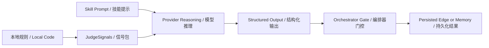

---

## 13. DeepAgents Integration

`AgentFactory.try_create_deep_agent()` builds a deepagents runtime only when:

- `runtime_mode == "deepagents"`
- provider is `OpenAICompatibleProvider`
- API key exists
- deepagents and langchain bindings are importable

When enabled, the deepagent is created with:

- model: `ChatOpenAI`
- skills root: `src/hnsw_logic/agents/skills`
- tools from the registry
- subagent specs from config
- `FilesystemBackend`

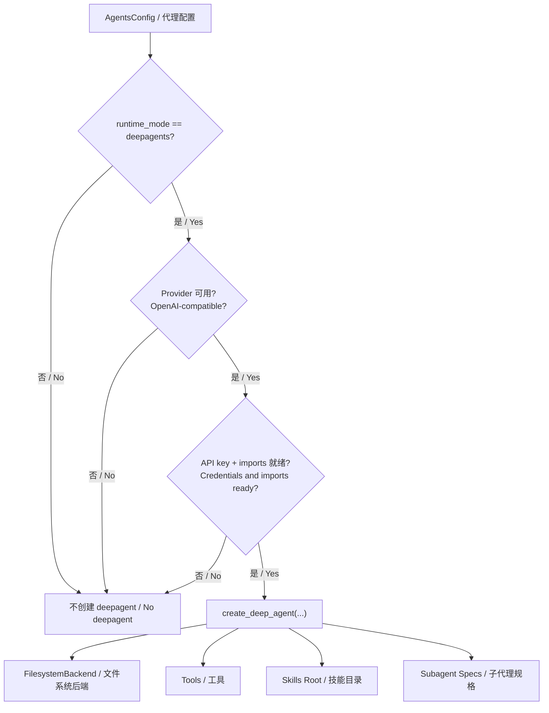

### Important nuance

The project is not using the deepagents object as the only execution engine today.
It is better to think of it as:

- an integration layer
- a future richer runtime path
- a capability shell around the same subagent roles

The explicit typed orchestrator remains the authoritative control path.

---

## 14. Failure Handling and Guard Rails

The system contains several explicit guard rails:

- bounded retry only
- graph write happens after judge and review
- duplicate-edge suppression
- mirror-edge generation only for selected relation types
- anchor eligibility filtering before discovery
- memory merge through deterministic code, not free-form agent state

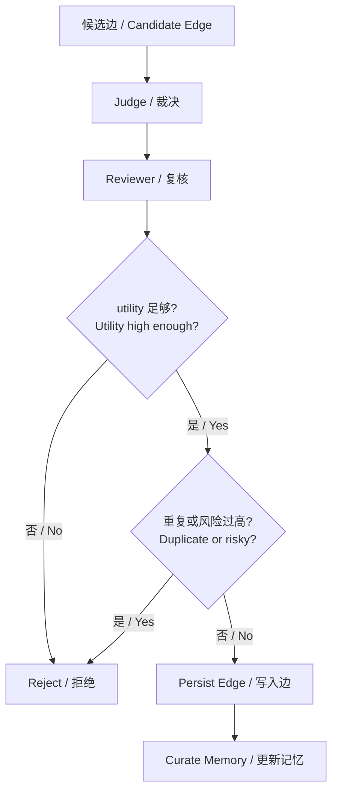

---

## 15. Practical Reading of the System

If you want to understand the system in execution order, read it like this:

1. [bootstrap.py](/Users/armstrong/gl-hnsw/src/hnsw_logic/services/bootstrap.py)
2. [pipeline.py](/Users/armstrong/gl-hnsw/src/hnsw_logic/services/pipeline.py)
3. [discovery.py](/Users/armstrong/gl-hnsw/src/hnsw_logic/services/discovery.py)
4. [orchestrator.py](/Users/armstrong/gl-hnsw/src/hnsw_logic/agents/orchestrator.py)
5. [provider.py](/Users/armstrong/gl-hnsw/src/hnsw_logic/embedding/provider.py)
6. [curator.py](/Users/armstrong/gl-hnsw/src/hnsw_logic/memory/curator.py)
7. [registry.py](/Users/armstrong/gl-hnsw/src/hnsw_logic/agents/tools/registry.py)

This order mirrors the real implementation dependencies.

---

## 16. Summary

The agent runtime of `gl-hnsw` is best understood as:

- offline-first
- orchestrator-controlled
- multi-role
- structured-context-driven
- memory-explicit
- deepagents-compatible
- but not dependent on open-ended autonomous agent loops

That is the core reason the system can remain both:

- `agent-centric`
- and still operationally stable enough to build a retrieval index.
