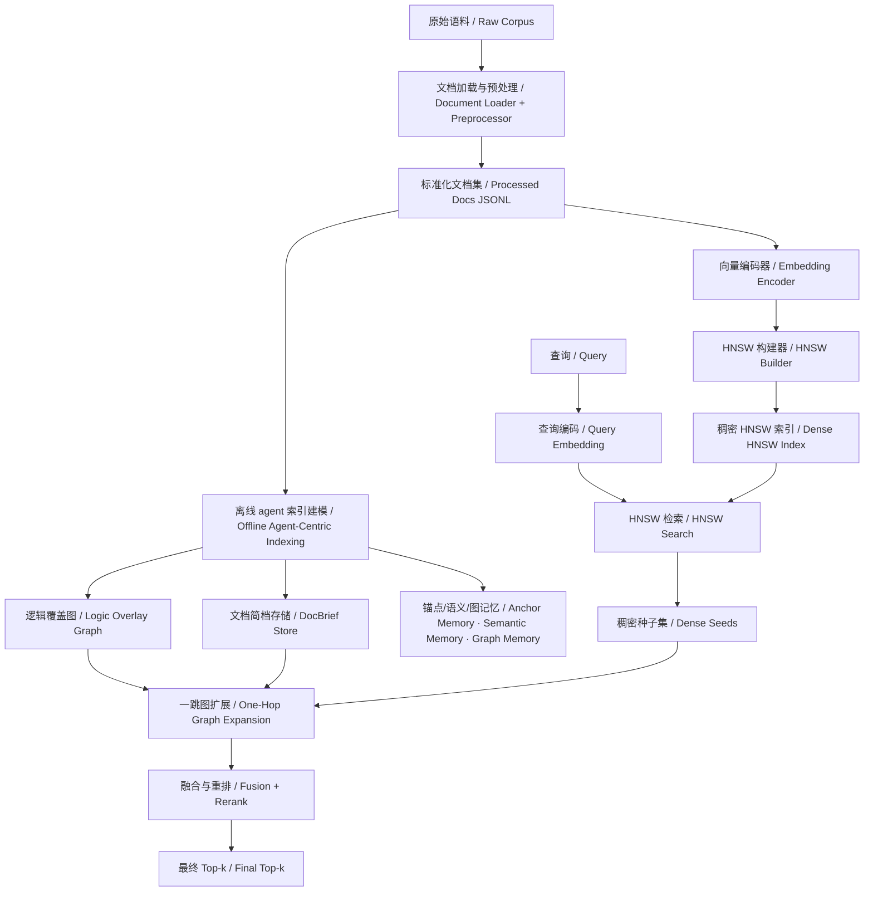
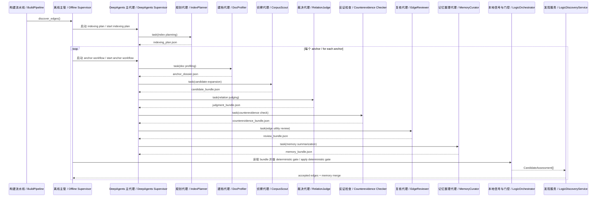
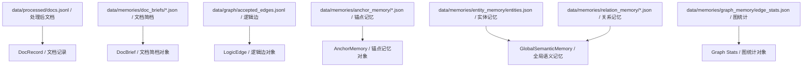
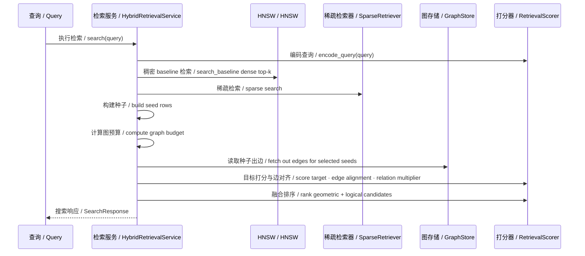

# gl-hnsw Architecture

本文档给出 `gl-hnsw` 当前实现的一版完整架构说明。文档重点覆盖：

- 系统目标与边界
- 离线 agent-centric 索引建模
- 在线检索执行链路
- 核心数据模型
- 存储布局
- 关键算法与打分逻辑
- 配置、API、任务执行与可观测性

本文档描述的是**当前仓库中的实际实现**，而不是抽象规划稿。

---

# 1. 设计目标与边界

## 1.1 核心目标

`gl-hnsw` 的目标是构建一个双层检索系统：

- **几何层**
  使用 HNSW 做 document-level dense ANN 检索。

- **逻辑层**
  使用离线 agent 系统构建逻辑覆盖图与结构化记忆，并在查询时做一跳、受控的逻辑扩展。

## 1.2 当前边界

当前系统刻意保持以下边界不变：

- HNSW 本体不改写
- 逻辑边不直接写入 HNSW 图结构
- 在线查询不调用 agent
- 在线查询只消费离线建好的图与本地信号
- 查询最多进行一跳逻辑扩展

## 1.3 当前实现立场

当前系统不是“LLM 直接替代检索器”，而是：

**HNSW 负责高效近邻检索，agent 负责离线索引建模，查询阶段只消费已经建好的索引与图。**

当前版本中，离线索引主链已经切换为 **DeepAgents supervisor 驱动**：

- supervisor 负责 planning、task delegation、filesystem context、skills/memory 调度
- `LogicOrchestrator` 退居为本地 signal/gate/fallback 层
- 在线查询阶段仍然保持“无 agent”

---

# 2. 总体架构

## 2.1 系统总览

## 2.2 运行时装配

系统的装配入口在 [src/hnsw_logic/services/bootstrap.py](../src/hnsw_logic/services/bootstrap.py)。

装配出的核心容器包括：

- `CorpusStore`
- `BriefStore`
- `GraphStore`
- `AnchorMemoryStore`
- `SemanticMemoryStore`
- `GraphMemoryStore`
- `EmbeddingEncoder`
- `HnswIndexBuilder`
- `HnswSearcher`
- `AgentFactory`
- `LogicDiscoveryService`
- `HybridRetrievalService`
- `BuildPipeline`
- `EvaluationService`
- `JobRegistry`

---

# 3. 模块分层

## 3.1 文档接入层

实现位于：

- [src/hnsw_logic/services/corpus.py](../src/hnsw_logic/services/corpus.py)
- [src/hnsw_logic/docs/loader.py](../src/hnsw_logic/docs/loader.py)
- [src/hnsw_logic/docs/preprocessor.py](../src/hnsw_logic/docs/preprocessor.py)

职责：

- 从 `data/raw/` 读取原始文档
- 规范化为 `DocRecord`
- 持久化到 `data/processed/docs.jsonl`

当前处理粒度是 document-level，不做 chunking。

## 3.2 向量索引层

实现位于：

- [src/hnsw_logic/embedding/encoder.py](../src/hnsw_logic/embedding/encoder.py)
- [src/hnsw_logic/hnsw/index_builder.py](../src/hnsw_logic/hnsw/index_builder.py)
- [src/hnsw_logic/hnsw/searcher.py](../src/hnsw_logic/hnsw/searcher.py)

职责：

- 生成文档 embedding
- 构建 HNSW 索引
- 提供纯 dense baseline 检索

索引持久化到：

- `data/indices/docs.bin`
- `data/indices/docs_meta.json`

## 3.3 离线 agent 建模层

实现位于：

- [src/hnsw_logic/agents/factory.py](../src/hnsw_logic/agents/factory.py)
- [src/hnsw_logic/agents/orchestrator.py](../src/hnsw_logic/agents/orchestrator.py)
- [src/hnsw_logic/services/offline_supervisor.py](../src/hnsw_logic/services/offline_supervisor.py)
- [src/hnsw_logic/services/discovery.py](../src/hnsw_logic/services/discovery.py)
- [src/hnsw_logic/services/pipeline.py](../src/hnsw_logic/services/pipeline.py)

职责：

- 生成 indexing plan
- 生成 `DocBrief`
- 选择 discovery anchor
- 发现候选 pair 并写入 workspace bundle
- 做 judge / checker / reviewer 共识裁决
- 写入逻辑边
- 更新锚点与全局记忆
- 受控更新 `.deepagents/AGENTS.md` 与 `references/`

## 3.4 查询执行层

实现位于：

- [src/hnsw_logic/retrieval/service.py](../src/hnsw_logic/retrieval/service.py)
- [src/hnsw_logic/retrieval/scorer.py](../src/hnsw_logic/retrieval/scorer.py)
- [src/hnsw_logic/retrieval/sparse.py](../src/hnsw_logic/retrieval/sparse.py)
- [src/hnsw_logic/retrieval/jump_policy.py](../src/hnsw_logic/retrieval/jump_policy.py)

职责：

- 生成 baseline dense seeds
- 生成 sparse supplemental seeds
- 基于离线图做一跳扩展
- 融合 geometric score 与 logical score
- 输出最终 `SearchResponse`

---

# 4. Offline Agent-Centric Indexing

## 4.1 子代理结构

当前 agent 体系由 `AgentFactory` 装配，包含以下子代理：

- `IndexPlannerAgent`
- `DocProfilerAgent`
- `CorpusScoutAgent`
- `RelationJudgeAgent`
- `CounterevidenceCheckerAgent`
- `EdgeReviewerAgent`
- `MemoryCuratorAgent`

当前默认运行方式已经切换为：

- `BuildPipeline.discover_edges()` 调用 `OfflineIndexingSupervisor`
- supervisor 使用 DeepAgents runtime 作为主控制流
- subagent 通过 `task` delegation 在隔离上下文中执行各阶段
- provider 负责远端模型调用
- `LogicOrchestrator` 负责本地 signal 构造、utility/gate 计算与最终 fallback

## 4.2 skills 结构

当前 canonical skills 目录位于：

- `.deepagents/skills/`

关键 skills 包括：

- `anchor-planning`
- `doc-briefing`
- `candidate-expansion`
- `evidence-bundling`
- `relation-judging`
- `counterevidence-check`
- `edge-utility-review`
- `graph-hygiene`
- `memory-summarization`
- `memory-update`

这些 skills 采用 DeepAgents 官方风格的按需加载目录结构：

- `SKILL.md`
- `references/`
- `scripts/`
- `assets/`（按需）

它们不直接作为在线查询逻辑执行器，而是为离线子代理提供规范化工作流、参考资料和局部脚本能力。

## 4.3 离线流程图

---

# 5. DocBrief, LogicEdge 与 Memory

## 5.1 Core 数据模型

核心模型定义在 [src/hnsw_logic/core/models.py](../src/hnsw_logic/core/models.py)。

### `DocRecord`

- `doc_id`
- `title`
- `text`
- `metadata`

### `DocBrief`

- `doc_id`
- `title`
- `summary`
- `entities`
- `keywords`
- `claims`
- `relation_hints`
- `metadata`

`DocBrief` 是整个离线 agent 建图和在线 graph-aware 检索的中介表示。

### `LogicEdge`

- `src_doc_id`
- `dst_doc_id`
- `relation_type`
- `confidence`
- `evidence_spans`
- `discovery_path`
- `edge_card_text`
- `created_at`
- `last_validated_at`
- `utility_score`

### `AnchorMemory`

- 已探索文档
- 被拒候选
- 已接受边
- 失败与成功查询
- 拒绝原因
- top candidate scores
- accepted edge scores

### `GlobalSemanticMemory`

- 实体 canonical form
- alias map
- relation patterns
- rejection patterns

## 5.2 存储布局

---

# 6. Anchor 选择与离线发现策略

## 6.1 为什么 anchor selection 很关键

离线 graph 的上限很大程度由 anchor 顺序决定。

如果只按文档原始顺序跑 discovery：

- 会浪费 remote budget
- 会让热点语义簇占满图预算
- 容易漏掉真正高 utility 的 bridge node

因此当前 orchestrator 实现了专门的 `rank_discovery_anchors()`。

## 6.2 当前 anchor ranking 的输入信号

当前排序是一个 coverage-aware、bridge-aware 的组合策略，核心信号包括：

- `discovery_anchor_priority`
- dense centrality
- dense neighborhood coverage
- corpus graph potential
- topic cluster diversity
- title specificity
- specific-title bridge potential
- bridge-rich corpus pressure

## 6.3 当前 anchor ranking 的策略

当前不是简单 top-k，而是：

1. 计算 group-level graph profile
2. 估计 dense neighborhood
3. 计算每个 anchor 的 base priority
4. 用 coverage gain 逐步选主预算 anchors
5. 使用 bridge reserve 把高 bridge potential 但未覆盖 cluster 的文档补进来

这就是当前 `nfcorpus` 能从“容易被单一热点簇主导”修正到“开始覆盖更多语义 basin”的关键原因。

---

# 7. Candidate 生成、Judge 与 Reviewer

## 7.1 候选生成

`scout()` 当前不是单一路径，而是合并多源候选：

- provider 提议候选
- local candidate proposals
- dense neighbor proposals
- mention / overlap 信号

对于 live provider，如果第一轮没有接受边，还会对高优先级 anchor 触发 `expanded=True` 的 second-pass scout。

## 7.2 Judge

judge 阶段会结合：

- dense score
- sparse score
- overlap score
- content overlap
- mention score
- direction score
- local support
- utility score
- relation fit scores

然后由 provider 给出结构化 verdict。

## 7.3 Reviewer / Checker

reviewer 不是简单重复判别，而是第二层共识机制：

- 复核 evidence consistency
- 复核 risk flags
- 复核 canonical relation
- 复核 utility 与 uncertainty

当前 reviewer 的作用是把“语义成立但检索价值弱”的边压掉。

---

# 8. Logic Graph 写入规则

## 8.1 mirror augmentation

对 `same_concept` 与 `comparison` 这类可逆边，系统会在满足置信度和 utility 条件时自动补镜像边。

该逻辑在 [src/hnsw_logic/services/discovery.py](../src/hnsw_logic/services/discovery.py) 中实现。

## 8.2 graph store 排序

`GraphStore.get_out_edges()` 不是按写入顺序返回，而是按如下优先级排序：

- `0.65 * confidence + 0.35 * utility_score`
- 次级排序使用 `utility_score`

这样查询期优先看到的就是最稳定、最有价值的边。

---

# 9. 查询阶段的执行链路

## 9.1 查询阶段的重要边界

当前默认 `AppContainer` 没有给 `HybridRetrievalService` 注入 `QueryStrategyAgent`。

这意味着：

- `QueryStrategyAgent` 类仍保留在代码中作为实验组件
- 但默认运行路径中不会使用在线 agent
- 当前线上口径是严格的 offline-agent-only

## 9.2 查询流程图

## 9.3 baseline 与 supplemental 的区别

### baseline

- query embedding
- HNSW top-k
- 直接返回

### supplemental

在 baseline 之上增加：

- sparse retriever
- supplemental seed 合并
- graph-aware budget
- one-hop graph expansion
- utility-aware rerank

---

# 10. 查询期打分逻辑

## 10.1 seed score

`RetrievalScorer.seed_score()` 综合：

- title embedding
- relation embedding
- claims embedding
- full-view embedding
- lexical query alignment
- structure alignment

## 10.2 target score

`score_target()` 比 seed 更强调：

- summary
- claims
- relation view

这是因为 graph jump 的目标更像“解释 query 的文档”，而不只是“像 query 的文档”。

## 10.3 edge signature gate

当前一个非常关键的查询期改动是：

**不是所有 graph edge 都能参与扩展，edge 还必须与 query 的 signature 对齐。**

`edge_query_alignment()` 综合：

- `edge_card_text` 与 query 的 overlap
- `evidence_spans` 与 query 的 overlap
- 目标文档 title / claims 与 query 的对齐
- 目标文档 structure 与 query 的对齐

这一步的作用是抑制一种典型错误：

“边本身语义成立，但对当前 query 不对题。”

## 10.4 short / specific query precision gate

对高 specificity query：

- sparse-only 候选更严格
- 需要更强的 title / claim 对齐
- 不允许正文中偶然出现 query token 的文档被过度抬高

这一步在 `nfcorpus` 上非常关键，因为它修正了 `DHA` 这类短 query 下 sparse 过度激进的问题。

## 10.5 最终融合

最终融合仍遵循：

`final_score = alpha * geometric_score + logic_weight * logical_score`

但 `logic_weight` 不是常数，而是会随以下因素变化：

- source kind
- edge utility
- relation type
- query alignment

---

# 11. 配置体系

## 11.1 配置文件

当前配置位于：

- [configs/app.yaml](../configs/app.yaml)
- [configs/hnsw.yaml](../configs/hnsw.yaml)
- [configs/agents.yaml](../configs/agents.yaml)
- [configs/retrieval.yaml](../configs/retrieval.yaml)

## 11.2 关键配置项

### provider

- `kind`
- `base_url`
- `api_key_env`
- `chat_model`
- `embedding_model`
- `embedding_dim`

### hnsw

- `m`
- `ef_construction`
- `ef_search`
- `vector_dim`
- `metric`

### agents

- `runtime_mode`
- `live_reasoning.enable_*`
- subagent -> skill mapping

### retrieval

- `initial_top_k`
- `max_expansions_per_seed`
- `adaptive_graph_*`
- `jump_policy.*`
- `fusion.alpha / beta`
- `edge_quality.*`

---

# 12. API 与任务系统

## 12.1 API

实现位于 [src/hnsw_logic/api/app.py](../src/hnsw_logic/api/app.py)。

当前提供：

- `POST /api/v1/build/embeddings`
- `POST /api/v1/build/hnsw`
- `POST /api/v1/build/profile`
- `POST /api/v1/build/discover`
- `POST /api/v1/admin/revalidate`
- `GET /api/v1/admin/jobs/{job_id}`
- `GET /api/v1/admin/health`
- `POST /api/v1/search`

## 12.2 后台任务

后台任务由：

- `ThreadPoolExecutor`
- `JobRegistry` (`SQLite`)

共同完成。

`JobRegistry` 持久化字段包括：

- `job_id`
- `job_type`
- `state`
- `payload`
- `message`
- `created_at`
- `updated_at`

---

# 13. 可观测性与调试

## 13.1 provider trace

live provider 调用会把 trace 写入：

- `data/workspace/remote_provider_traces.jsonl`

常见 stage：

- `profile_docs_batch`
- `profile_doc`
- `judge_relations_batch`
- `review_relations_batch`
- `curate_memory`

## 13.2 graph artifacts

- `data/graph/accepted_edges.jsonl`
- `data/memories/graph_memory/edge_stats.json`

## 13.3 anchor memory

- `data/memories/anchor_memory/*.json`

可用于定位：

- 哪些候选被拒
- 拒绝原因
- top candidate scores
- accepted edge scores

---

# 14. 当前架构的优势与局限

## 14.1 优势

- 离线 agent 与在线查询解耦
- query path 可控、可测、低波动
- graph utility 直接服务于检索，而不是停留在语义描述层
- 支持跨语料的通用调优，而不需要在线 prompt 兜底

## 14.2 局限

- current graph 仍然是一跳图
- offline discovery 成本仍然较高
- 外域语料上的 uplift 还不均衡
- deepagent runtime 本体目前更多是可选装配能力，主工作流仍由 orchestrator + provider abstractions 驱动

---

# 15. 当前版本的工程结论

当前 `gl-hnsw` 已经形成了一条明确、稳定的工程路线：

1. 保持 HNSW 为 dense baseline
2. 用离线 agent 建立高 utility 逻辑图
3. 用纯本地查询路径消费这张图
4. 用 query alignment 和 utility gate 控制逻辑扩展

这套架构已经不再是“实验性 prompt 叠加器”，而是一套有清晰边界、可评测、可回归、可持续优化的索引增强系统。
