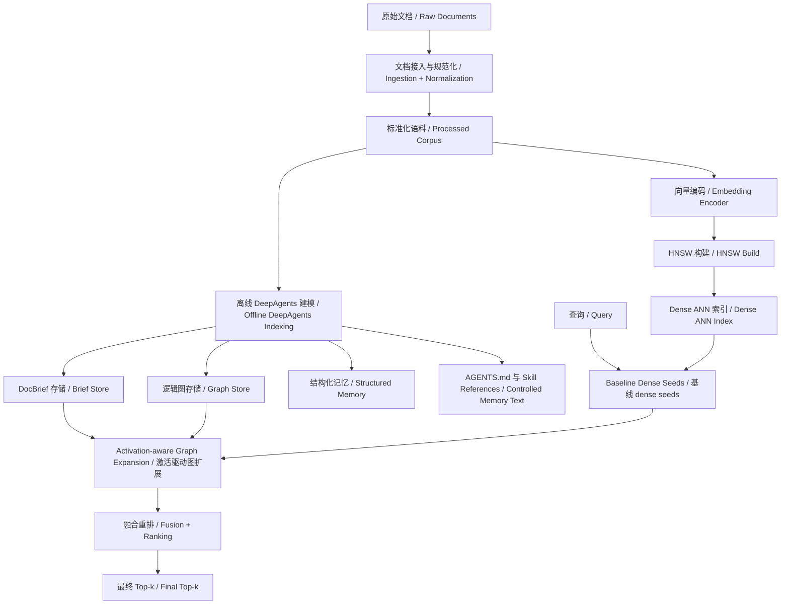
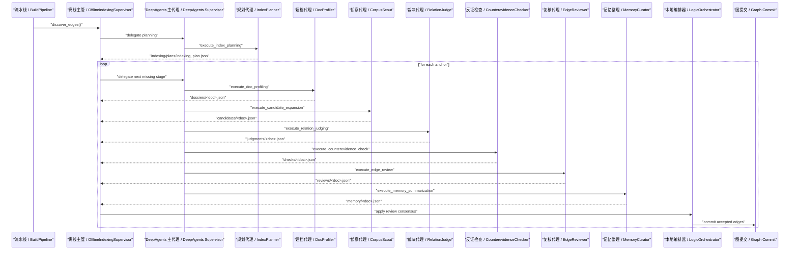
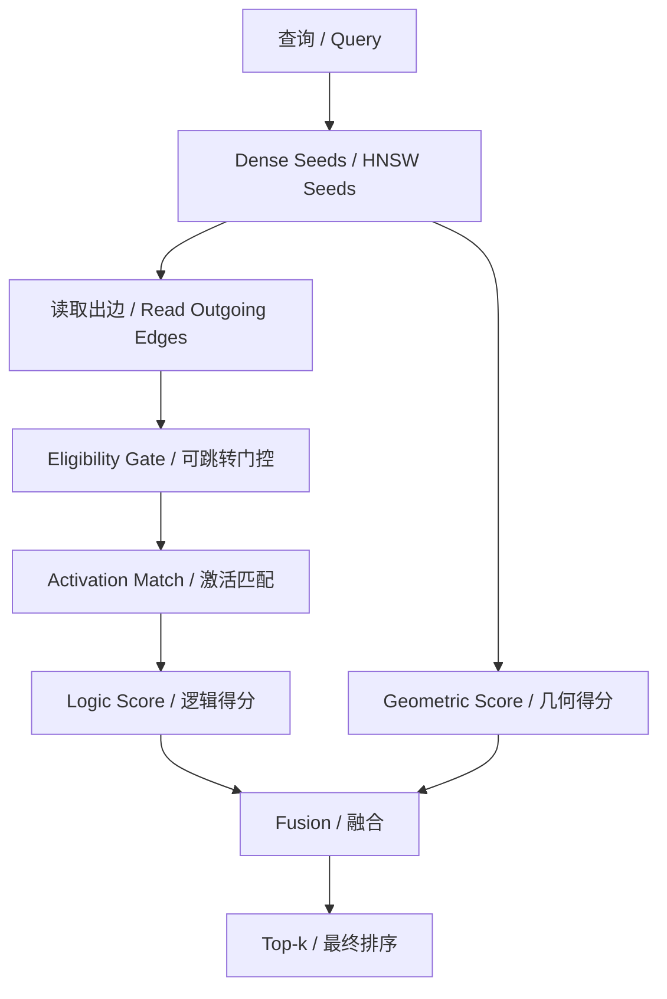

# gl-hnsw DeepAgents Architecture Whitepaper

本文档是一篇面向实现的技术白皮书，描述 `gl-hnsw` 当前仓库中的真实系统，而不是抽象规划稿。它覆盖：

- 系统目标、边界与形式化问题定义
- 离线 DeepAgents 主链路的真实执行机制
- 主 agent 与各 subagent 的分工
- skills 的加载、调用与脚本化信号生产
- 从局部信号到 verdict、从 verdict 到逻辑边、从逻辑边到在线激活的完整数学过程
- 评测语义、工程约束与当前已知限制

本文档对应的实现主入口包括：

- [应用装配 / `src/hnsw_logic/app/container.py`](../../src/hnsw_logic/app/container.py)
- [离线主管 / `src/hnsw_logic/indexing/supervisor.py`](../../src/hnsw_logic/indexing/supervisor.py)
- [主编排器 / `src/hnsw_logic/agents/orchestration/orchestrator.py`](../../src/hnsw_logic/agents/orchestration/orchestrator.py)
- [DeepAgents 运行时 / `src/hnsw_logic/agents/runtime/execution.py`](../../src/hnsw_logic/agents/runtime/execution.py)
- [skills 运行时 / `src/hnsw_logic/agents/runtime/skill_runtime.py`](../../src/hnsw_logic/agents/runtime/skill_runtime.py)
- [在线检索 / `src/hnsw_logic/retrieval/service.py`](../../src/hnsw_logic/retrieval/service.py)
- [评分器 / `src/hnsw_logic/retrieval/scorer.py`](../../src/hnsw_logic/retrieval/scorer.py)
- [跳转门控 / `src/hnsw_logic/retrieval/jump_policy.py`](../../src/hnsw_logic/retrieval/jump_policy.py)
- [live provider / `src/hnsw_logic/embedding/providers/live.py`](../../src/hnsw_logic/embedding/providers/live.py)
- [agent 配置 / `configs/agents.yaml`](../../configs/agents.yaml)

---

## 1. 摘要

`gl-hnsw` 是一个双层检索系统：

1. 几何层使用 document-level HNSW 完成高召回、低延迟的 dense ANN 检索。
2. 逻辑层使用离线 DeepAgents 链路构建一张稀疏、可审计的 logic overlay graph，并在查询期做一跳、受控的逻辑扩展。

该系统的核心立场不是“让 LLM 取代检索器”，而是：

> 让 agent 在离线阶段承担昂贵的结构化建模，把复杂判断前移到索引构建阶段；在线阶段只消费固定索引、图结构、activation profile 与本地打分器。

因此，当前系统的唯一生产语义是：

- 离线：`BuildPipeline -> OfflineIndexingSupervisor -> full DeepAgents delegation -> workspace artifacts -> thin commit`
- 在线：`pure HNSW baseline` 或 `HNSW + DeepAgents-built overlay`，不在查询期调用 agent

---

## 2. 形式化问题定义

令文档集合为

$$
\mathcal{D} = \{d_1, d_2, \dots, d_N\}
$$

每个文档在离线阶段被压缩为 brief：

$$
b_i = \phi(d_i)
$$

其中 $\phi$ 由 `DocProfiler` 与后处理器共同实现，产出：

- 标题 $t_i$
- 摘要 $s_i$
- 实体集合 $E_i$
- 关键词集合 $K_i$
- claim 集合 $C_i$
- relation hint 集合 $H_i$
- 元数据 $M_i$

HNSW 提供一个 dense seed 检索器：

$$
\mathcal{N}_{\text{dense}}(q) = \operatorname{HNSW}(q)
$$

离线 agent 构建一张逻辑图：

$$
G = (\mathcal{D}, \mathcal{E})
$$

其中每条边

$$
e_{ij} = (d_i \rightarrow d_j, r_{ij}, c_{ij}, u_{ij}, a_{ij})
$$

包含：

- 关系类型 $r_{ij}$
- 置信度 $c_{ij}$
- 检索 utility $u_{ij}$
- activation profile $a_{ij}$

在线目标不是替代 dense 检索，而是在有限预算下，从 dense seeds 出发，选择极少量高价值边进行扩展，以最大化最终 ranking quality：

$$
\max \operatorname{Recall@}k,\ \operatorname{MRR@}k,\ \operatorname{NDCG@}k
$$

同时约束：

- 图必须稀疏
- 扩展必须低 drift
- 查询期保持 agent-free

---

## 3. 系统边界与设计原则

### 3.1 不变量

当前实现固定了以下边界：

- 不改写 HNSW 内部图结构
- 逻辑边只存在于 sidecar graph，不回写 ANN 图
- 在线查询默认不使用 agent
- 查询最多做一跳图扩展
- Python 代码只保留硬边界，软策略尽量迁移到 skills/references

### 3.2 运行时原则

项目级 DeepAgents memory 见 [`.deepagents/AGENTS.md`](../../.deepagents/AGENTS.md)。其中明确规定：

- 以 retrieval utility 为第一目标
- `topic_consistency`、`duplicate_risk`、`bridge_information_gain`、`contrast_evidence` 等是 grounded signals
- reviewer/checker 结论高于本地软启发式
- Python 源码与核心 `SKILL.md` 不是自更新目标

---

## 4. 总体架构

系统装配入口见 [应用容器 / `src/hnsw_logic/app/container.py`](../../src/hnsw_logic/app/container.py)。容器一次性装配：

- `CorpusStore`
- `BriefStore`
- `GraphStore`
- `AnchorMemoryStore`
- `SemanticMemoryStore`
- `GraphMemoryStore`
- `EmbeddingEncoder`
- `HnswIndexBuilder`
- `HnswSearcher`
- `AgentFactory`
- `LogicDiscoveryService`
- `OfflineIndexingSupervisor`
- `HybridRetrievalService`
- `BuildPipeline`
- `EvaluationService`

---

## 5. 目录与模块职责

### 5.1 `src/hnsw_logic/app`

- [容器 / `container.py`](../../src/hnsw_logic/app/container.py)
  负责依赖注入和对象图装配。

### 5.2 `src/hnsw_logic/domain`

- [数据模型 / `models.py`](../../src/hnsw_logic/domain/models.py)
- [协议 / `protocols.py`](../../src/hnsw_logic/domain/protocols.py)
- [facet 推断 / `facets.py`](../../src/hnsw_logic/domain/facets.py)
- [序列化 / `serialization.py`](../../src/hnsw_logic/domain/serialization.py)
- [token 工具 / `tokens.py`](../../src/hnsw_logic/domain/tokens.py)

该层不依赖具体 provider 或 runtime。

### 5.3 `src/hnsw_logic/storage`

- 语料：[`corpus_store.py`](../../src/hnsw_logic/storage/corpus_store.py)
- brief：[`brief_store.py`](../../src/hnsw_logic/storage/brief_store.py)
- graph：[`graph_store.py`](../../src/hnsw_logic/storage/graph_store.py)
- jobs：[`jobs_store.py`](../../src/hnsw_logic/storage/jobs_store.py)
- memory：[`storage/memory/*`](../../src/hnsw_logic/storage/memory)

### 5.4 `src/hnsw_logic/embedding/providers`

- [抽象接口 / `base.py`](../../src/hnsw_logic/embedding/providers/base.py)
- [共享类型 / `types.py`](../../src/hnsw_logic/embedding/providers/types.py)
- [远端 transport / `client.py`](../../src/hnsw_logic/embedding/providers/client.py)
- [stub provider / `stub.py`](../../src/hnsw_logic/embedding/providers/stub.py)
- [live provider / `live.py`](../../src/hnsw_logic/embedding/providers/live.py)

### 5.5 `src/hnsw_logic/agents`

- orchestration：[`agents/orchestration/orchestrator.py`](../../src/hnsw_logic/agents/orchestration/orchestrator.py)
- runtime：
  - [`execution.py`](../../src/hnsw_logic/agents/runtime/execution.py)
  - [`models.py`](../../src/hnsw_logic/agents/runtime/models.py)
  - [`skill_runtime.py`](../../src/hnsw_logic/agents/runtime/skill_runtime.py)
  - [`toolsets.py`](../../src/hnsw_logic/agents/runtime/toolsets.py)
- subagents：[`agents/subagents/*`](../../src/hnsw_logic/agents/subagents)
- [装配工厂 / `factory.py`](../../src/hnsw_logic/agents/factory.py)

### 5.6 `src/hnsw_logic/indexing`

- [流水线 / `pipeline.py`](../../src/hnsw_logic/indexing/pipeline.py)
- [离线主管 / `supervisor.py`](../../src/hnsw_logic/indexing/supervisor.py)
- [发现服务 / `discovery.py`](../../src/hnsw_logic/indexing/discovery.py)
- [索引构建 / `index_builder.py`](../../src/hnsw_logic/indexing/index_builder.py)

### 5.7 `src/hnsw_logic/retrieval`

- [服务入口 / `service.py`](../../src/hnsw_logic/retrieval/service.py)
- [评分器 / `scorer.py`](../../src/hnsw_logic/retrieval/scorer.py)
- [跳转门控 / `jump_policy.py`](../../src/hnsw_logic/retrieval/jump_policy.py)
- [稀疏召回 / `sparse.py`](../../src/hnsw_logic/retrieval/sparse.py)
- [HNSW 查询 / `searcher.py`](../../src/hnsw_logic/retrieval/searcher.py)

### 5.8 `src/hnsw_logic/evaluation`

- [BEIR 评测 / `beir.py`](../../src/hnsw_logic/evaluation/beir.py)
- [demo 评测 / `demo.py`](../../src/hnsw_logic/evaluation/demo.py)

---

## 6. 离线 DeepAgents 主链路

### 6.1 子代理拓扑

子代理配置定义于 [配置文件 / `configs/agents.yaml`](../../configs/agents.yaml)。当前角色、skill 和工具面如下。

| Agent | 主要职责 | Skills | Tool scopes |
|---|---|---|---|
| `index_planner` | 生成 anchor 顺序与 batch 计划 | `anchor-planning`, `corpus-adaptation`, `delegation-policy` | `read_doc_brief`, `load_anchor_memory`, `read_graph_stats`, `read_semantic_memory`, `read_execution_manifest`, `audit_anchor_execution` |
| `doc_profiler` | 形成 dossier 和 brief | `doc-briefing`, `entity-canonicalization` | `read_doc_full`, `read_doc_brief` |
| `corpus_scout` | 候选发现与 bundle 化 | `candidate-expansion`, `evidence-bundling` | `read_doc_brief`, `search_summaries`, `lookup_entities`, `get_hnsw_neighbors`, `read_anchor_dossier`, `compute_topic_consistency`, `compute_bridge_gain` |
| `relation_judge` | 判定 tentative relation/verdict | `relation-judging`, `signal-fusion` | `read_anchor_dossier`, `read_candidate_bundle`, `compute_topic_consistency`, `compute_contrast_evidence`, `compute_relation_fit` |
| `counterevidence_checker` | 发现 duplicate/drift/weak direction | `counterevidence-check`, `graph-hygiene`, `execution-audit` | `read_candidate_bundle`, `read_judgment_bundle`, `read_failure_patterns`, `read_execution_manifest`, `audit_anchor_execution`, `compute_duplicate_risk`, `compute_topic_consistency`, `compute_contrast_evidence` |
| `edge_reviewer` | 以 retrieval utility 为中心做 keep/drop | `edge-utility-review`, `graph-hygiene`, `metric-evaluation` | `read_candidate_bundle`, `read_judgment_bundle`, `read_counterevidence_bundle`, `evaluate_anchor_utility`, `compute_bridge_gain`, `compute_query_activation_profile`, `compute_candidate_utility` |
| `memory_curator` | 汇总 learned/failure patterns | `memory-summarization`, `memory-update` | `read_anchor_dossier`, `read_review_bundle`, `read_failure_patterns` |

### 6.2 主控制流

### 6.3 强执行壳：manifest + audit

每个 anchor 有一个 [执行清单 / `ExecutionManifest`](../../src/hnsw_logic/agents/runtime/models.py)，字段包括：

- `current_stage`
- `completed_stages`
- `failed_stages`
- `retry_counts`
- `delegation_round`
- `halt_requested`

运行时审计由 [审计函数 / `audit_execution_state()`](../../src/hnsw_logic/agents/runtime/execution.py) 完成。它判断：

- 哪些 stage artifact 已经存在
- 哪些 stage 缺失
- 是否 ready for commit
- 是否 workflow complete
- 是否 retry exhausted

因此 DeepAgents 不是“一次 prompt 跑到底”，而是：

$$
\text{stateful loop} = \text{audit} \rightarrow \text{delegate next stage} \rightarrow \text{re-audit}
$$

直到：

- 所有 required stages 完成，或
- 某 stage 重试达到上限，触发 halt

---

## 7. Skills 作为策略知识与脚本信号层

### 7.1 目录结构

唯一 runtime skill root 是 [`.deepagents/skills`](../../.deepagents/skills)。

每个 skill 采用相同结构：

- `SKILL.md`
- `references/`
- `scripts/`
- `assets/`（可选）

`SKILL.md` 只保留：

- 触发条件
- 工作流
- 工具纪律

策略性长文本放在 `references/`，可程序化局部判断放在 `scripts/`。

### 7.2 动态加载机制

[技能运行时 / `SkillSignalRuntime`](../../src/hnsw_logic/agents/runtime/skill_runtime.py) 使用 `importlib.util.spec_from_file_location` 动态加载 skill 脚本，并缓存 `main(payload)`。

记号上可以把它写成：

$$
\psi_{s,f}(x) = \texttt{main}_{s,f}(x)
$$

其中：

- $s$ 为 skill 名称
- $f$ 为脚本名
- $x$ 为 JSON-serializable payload

返回值必须是字典：

$$
\psi_{s,f}(x) \in \mathbb{D}
$$

否则 runtime 直接报错。

### 7.3 当前关键脚本与语义

| Skill script | 作用 |
|---|---|
| `signal-fusion/compute_topic_consistency.py` | 产出 `topic_consistency`, `query_surface_match`, `drift_risk`, `uncertainty_hint` |
| `counterevidence-check/compute_duplicate_risk.py` | 产出 `duplicate_risk` 与 duplicate 型 drift |
| `edge-utility-review/compute_bridge_gain.py` | 产出 `bridge_information_gain` 与新词面增益 |
| `relation-judging/compute_contrast_evidence.py` | 产出 `contrast_evidence` |
| `relation-judging/score_relation_fit.py` | 计算 5 类 canonical relations 的 fit 分数 |
| `edge-utility-review/score_candidate_utility.py` | 计算候选边的 retrieval utility |
| `metric-evaluation/compute_query_activation_profile.py` | 生成在线使用的 activation profile |
| `anchor-planning/rank_anchor_priority.py` | 计算 anchor priority |
| `candidate-expansion/rank_candidate_priority.py` | 计算 candidate priority |
| `edge-utility-review/select_edge_budget.py` | 计算 edge budget selection score |

---

## 8. 离线信号层的数学定义

### 8.1 局部候选度量

对 anchor $a$ 与 candidate $c$，主编排器先计算一个局部 metric 向量：

$$
m(a,c) = \bigl(
\text{dense},
\text{overlap},
\text{content\_overlap},
\text{mention},
\text{role\_listing},
\text{forward\_ref},
\text{reverse\_ref},
\text{family\_bridge},
\text{topic\_family\_match},
\text{topic\_cluster\_match},
\text{stance\_contrast},
\text{topic\_drift},
\text{local\_support}
\bigr)
$$

其中核心分量定义如下。

#### overlap score

$$
\text{overlap} =
\min\left(
\frac{
|K_a \cap K_c| + |E_a \cap E_c| + |H_a \cap H_c| + |T_a \cap T_c|
}{5}, 1
\right)
$$

#### content overlap score

令 $\widetilde{C}_a, \widetilde{C}_c$ 为 normalized content-term sets，则：

$$
\text{content\_overlap} =
\min\left(\frac{|\widetilde{C}_a \cap \widetilde{C}_c|}{6}, 1\right)
$$

#### novel term ratio

$$
\text{novel\_term\_ratio} =
\min\left(
\frac{|\widetilde{C}_c \setminus \widetilde{C}_a|}{\max(1,\min(|\widetilde{C}_c|, 8))}, 1
\right)
$$

#### local support

当前实现中：

$$
\begin{aligned}
\text{local\_support}
= {} & 0.42 \cdot \text{dense}
      + 0.20 \cdot \text{overlap}
      + 0.22 \cdot \text{mention} \\
    & + 0.08 \cdot \text{role\_listing}
      + 0.08 \cdot \min(1.5 \cdot \text{length\_ratio}, 1) \\
    & + 0.06 \cdot \text{topic\_cluster\_match}
      + 0.04 \cdot \text{stance\_contrast}
\end{aligned}
$$

### 8.2 bridge information gain

主编排器内部有一个嵌入增强版 `bridge_information_gain`，但 skills 中也保留了一个轻量代理版。当前真正用于 signal runtime 的脚本版本近似为：

$$
\text{bridge\_gain}
=
\min\left(
0.5 \cdot \text{novel\_surface}
 + 0.25 \cdot \text{mention}
 + 0.25 \cdot \text{dense},
1
\right)
$$

其中 `novel_surface` 表示 candidate 相对 anchor 暴露的新词面比例。

### 8.3 topic consistency

signal-fusion skill 给出：

$$
\text{topic\_consistency}
=
\min\left(
0.45 \cdot \text{lexical}
 + 0.25 \cdot \text{family\_match}
 + 0.20 \cdot \text{cluster\_match}
 + 0.10 \cdot \min(\text{title\_overlap}, 2),
1
\right)
$$

并定义：

$$
\text{drift\_risk} = \max(0, 0.65 - \text{topic\_consistency})
$$

若本地 `topic_alignment = 1`，则脚本会强制：

$$
\text{topic\_consistency} \ge 0.72,\quad
\text{drift\_risk} \le 0.22
$$

### 8.4 duplicate risk

counterevidence skill 定义：

$$
\text{duplicate\_risk}
=
\min\left(
0.65 \cdot \text{lexical\_similarity}
 + 0.35 \cdot \text{content\_overlap},
1
\right)
$$

若 `topic_family` 一致，则 duplicate 风险被轻微缩放：

$$
\text{duplicate\_risk} \leftarrow 0.92 \cdot \text{duplicate\_risk}
$$

### 8.5 contrast evidence

relation-judging skill 定义：

$$
\text{contrast\_evidence}
=
\min\left(
0.45 \cdot \text{stance\_contrast}
 + 0.25 \cdot \text{lexical\_contrast}
 + 0.30 \cdot \text{local\_contrast},
1
\right)
$$

其中 `lexical_contrast` 来自 verdict 的 `decision_reason + rationale + contradiction_flags` 与一组 contrast cue 的交集。

### 8.6 unified signal report

`SkillSignalRuntime.build_signal_report()` 将多脚本输出组合为统一信号报告：

$$
\sigma(a,c) =
\{
\text{topic\_consistency},
\text{duplicate\_risk},
\text{bridge\_information\_gain},
\text{contrast\_evidence},
\text{query\_surface\_match},
\text{uncertainty\_hint},
\text{drift\_risk}
\}
$$

这个 $\sigma$ 不是最终裁决，而是 judge/checker/reviewer 的 grounded evidence。

---

## 9. 从信号到关系判定

### 9.1 relation fit scores

relation-judging skill 会对五类 canonical relation 计算打分：

- `implementation_detail`
- `supporting_evidence`
- `prerequisite`
- `comparison`
- `same_concept`

以 `comparison` 为例：

$$
\begin{aligned}
\text{fit}_{\text{comparison}}
= {} & 0.22 \cdot \text{topic\_consistency}
      + 0.22 \cdot \text{contrast\_evidence}
      + 0.16 \cdot \text{bridge\_gain} \\
    & + 0.12 \cdot \text{query\_surface\_match}
      + 0.10 \cdot \text{overlap}
      + 0.08 \cdot \text{family\_match} \\
    & + 0.06 \cdot \text{cluster\_match}
      + 0.08 \cdot \text{stance\_contrast}
      - 0.12 \cdot \text{duplicate\_risk}
      - 0.14 \cdot \text{drift\_risk}
\end{aligned}
$$

以 `same_concept` 为例：

$$
\begin{aligned}
\text{fit}_{\text{same\_concept}}
= {} & 0.28 \cdot \text{dense}
      + 0.22 \cdot \text{overlap}
      + 0.16 \cdot \text{bridge\_gain} \\
    & + 0.14 \cdot \text{topic\_consistency}
      + 0.10 \cdot \text{topic\_alignment}
      + 0.10 \cdot \text{query\_surface\_match} \\
    & - 0.14 \cdot \text{duplicate\_risk}
      - 0.14 \cdot \text{drift\_risk}
\end{aligned}
$$

argumentative corpus 中会进一步做：

$$
\text{fit}_{\text{comparison}} \mathrel{+}= 0.1 \cdot \max(\text{family\_match}, \text{cluster\_match})
$$

而 evidence-like corpora 则加强 `same_concept` 与 `supporting_evidence`。

### 9.2 utility score

review skill 脚本中，候选 utility 定义为：

$$
\begin{aligned}
u(a,c,r) = {} &
0.24 \cdot \text{local\_support}
 + 0.16 \cdot \text{dense}
 + 0.14 \cdot \text{bridge\_gain}
 + 0.14 \cdot \text{topic\_consistency} \\
& + 0.10 \cdot \text{query\_surface\_match}
 + 0.10 \cdot \text{fit}_r
 + 0.06 \cdot \text{mention}
 + 0.06 \cdot \text{overlap}
 + 0.06 \cdot \text{contrast\_evidence} \\
& - 0.12 \cdot \text{duplicate\_risk}
 - 0.14 \cdot \text{drift\_risk}
 - 0.08 \cdot \text{service\_surface}
\end{aligned}
$$

不同 relation 再做少量 relation-specific adjustments：

- `comparison` 增强 `contrast_evidence`
- `same_concept` 增强 `dense + overlap`
- `prerequisite` 增强 `specific_role_score`

---

## 10. Verdict-first 共识与薄 gate

### 10.1 judge/checker/reviewer 的职责

- judge：决定 tentative verdict
- checker：寻找 duplicate、weak direction、topic drift、low utility 反证
- reviewer：以 retrieval utility 为中心做最终 keep/drop 复核

### 10.2 共识对象

编排器并不直接信任单个模型输出，而是把 `judge result` 与 `review result` 合成一个最终 verdict：

$$
v^\star = \operatorname{Consensus}(v_{\text{judge}}, v_{\text{review}}, \sigma)
$$

当前实现中 reviewer 优先，但本地仍保留硬边界：

- 不支持的 relation
- graph hygiene failure
- duplicate persistence key
- confidence / support / evidence quality 低于门槛
- contradiction 且 reviewer 未显式接受

### 10.3 hard gate

若下式成立，则直接拒绝：

$$
\text{drift\_risk} \ge 0.82 \land \text{topic\_consistency} < 0.20 \land \text{bridge\_gain} < 0.28
$$

或

$$
\text{drift\_risk} \ge 0.62 \land \text{topic\_consistency} < 0.32 \land \text{bridge\_gain} < 0.38
$$

另一个显式 duplicate veto 为：

$$
\text{duplicate\_risk} \ge 0.90 \land \text{bridge\_gain} < 0.25
$$

### 10.4 threshold family

relation-specific thresholds 来自 [配置 / `src/hnsw_logic/config/schema.py`](../../src/hnsw_logic/config/schema.py)：

- `min_confidence`
- `min_support`
- `min_evidence_quality`

例如默认：

- `same_concept`: `0.90 / 0.50 / 0.40`
- `comparison`: `0.92 / 0.55 / 0.45`

### 10.5 final edge score

通过 gate 后，候选边得到最终离线排序分数：

$$
\begin{aligned}
s(a,c) = {} &
\text{confidence}
\cdot \text{support}
\cdot \text{evidence\_quality}
\cdot \text{relation\_prior}(r) \\
& \cdot \left(0.84 + 0.32 \cdot \text{fit}_r\right)
\cdot \left(0.82 + 0.36 \cdot \text{utility}\right) \\
& \cdot \left(0.86 + 0.28 \cdot \text{bridge\_gain}\right)
\cdot \left(0.88 + 0.20 \cdot \text{topic\_consistency}\right) \\
& \cdot \left(0.90 + 0.10 \cdot (1 - \text{duplicate\_risk})\right)
\end{aligned}
$$

这一步对应 [候选评估 / `_assessment_for()`](../../src/hnsw_logic/agents/orchestration/orchestrator.py)。

---

## 11. Anchor planning 与 candidate prioritization

### 11.1 anchor priority

anchor-planning skill 给出的优先级：

$$
\text{priority} = \text{base\_priority} + \text{dynamic\_priority} + 0.08 \cdot \text{graph\_potential}
$$

其中：

$$
\begin{aligned}
\text{base\_priority}
= {} & 0.18 \cdot \text{claim\_score}
 + 0.14 \cdot \text{keyword\_score}
 + 0.12 \cdot \text{entity\_score} \\
& + 0.12 \cdot \text{cue\_score}
 + 0.10 \cdot \text{content\_score}
 + 0.10 \cdot \text{dataset\_signal} \\
& + 0.10 \cdot \text{bridge\_potential}
 + 0.08 \cdot \text{centrality}
 + 0.06 \cdot \text{specificity}
\end{aligned}
$$

而：

$$
\text{dynamic\_priority}
=
0.20 \cdot \text{coverage\_gain}
+ 0.07 \cdot \text{cluster\_novelty}
+ 0.09 \cdot \text{family\_novelty}
+ 0.06 \cdot \text{bridge\_pressure}
+ 0.04 \cdot \text{argument\_ratio}
$$

### 11.2 candidate priority

candidate-expansion skill 定义：

$$
\begin{aligned}
\text{priority}_{\text{cand}} = {} &
\text{base\_score}
 + 0.18 \cdot \text{local\_support}
 + 0.12 \cdot \max_r \text{fit}_r \\
& + 0.18 \cdot \text{bridge\_gain}
 + 0.12 \cdot \text{topic\_consistency}
 + 0.10 \cdot \text{query\_surface\_match} \\
& + 0.08 \cdot \text{contrast\_evidence}
 - 0.14 \cdot \text{duplicate\_risk}
 - 0.12 \cdot \text{drift\_risk}
 - 0.06 \cdot \text{uncertainty}
\end{aligned}
$$

因此，当前系统不是单纯按 dense 相似度选候选，而是按“局部相似 + utility-aware signal layer”联合排序。

---

## 12. Activation profile 与在线逻辑边激活

### 12.1 activation profile 的字段

每条 accepted edge 都附带一个 `activation_profile`，当前最小字段为：

- `topic_signature`
- `query_surface_terms`
- `edge_use_cases`
- `drift_risk`
- `activation_prior`
- `negative_patterns`

由 [skill 脚本 / `metric-evaluation/scripts/compute_query_activation_profile.py`](../../.deepagents/skills/metric-evaluation/scripts/compute_query_activation_profile.py) 生成。

### 12.2 activation prior

脚本定义：

$$
\text{activation\_prior}
=
\min(
0.38 \cdot \text{utility}
 + 0.32 \cdot \text{bridge\_gain}
 + 0.18 \cdot \text{topic\_consistency}
 + 0.12 \cdot \text{query\_surface\_match},
1
)
$$

### 12.3 activation match

在线阶段，评分器不再主要依赖 relation label，而是计算 query 与 activation profile 的匹配：

$$
\begin{aligned}
\text{activation\_match}(q,e) = {} &
0.30 \cdot \text{surface\_overlap}
 + 0.20 \cdot \text{topic\_overlap}
 + 0.30 \cdot \text{query\_alignment} \\
& + 0.20 \cdot \text{title\_claim\_alignment}
 + \text{use\_case\_bonus}
\end{aligned}
$$

其中 `use_case_bonus` 由 `edge_use_cases` 决定，例如：

- `same-topic-contrast`
- `claim-support`
- `concept-bridge`
- `mechanism-detail`

若 `negative_patterns` 含 `topic_drift` 或 `near_duplicate`，会再进行抑制。

### 12.4 activation multiplier

$$
\text{activation\_multiplier}
=
\operatorname{clip}\left(
\left(
0.35
+ 0.40 \cdot \text{activation\_match}
+ 0.25 \cdot \text{activation\_prior}
\right)
\cdot
\left(
1 - 0.35 \cdot \text{drift\_risk}
\right),
0.15, 1.1
\right)
$$

---

## 13. 查询期检索流程

### 13.1 基线：纯 HNSW

[基线路径 / `search_baseline()`](../../src/hnsw_logic/retrieval/service.py) 的语义非常严格：

- query 编码
- 调用 HNSW search
- 直接返回 top-k
- 不引入 graph
- 不引入 sparse supplemental
- 不引入 memory bias

这就是 benchmark 中的“纯 HNSW baseline”。

### 13.2 DeepAgents overlay

[overlay 路径 / `search_deepagents_overlay()`](../../src/hnsw_logic/retrieval/service.py) 的语义是：

- dense seeds 仍然来自 HNSW
- 不走 sparse supplemental seeding
- 只使用离线图边做扩展
- 可选 memory bias 关闭

因此评测对比是：

$$
\text{baseline} = \text{HNSW}
$$

$$
\text{overlay} = \text{HNSW seeds} + \text{DeepAgents-built graph edges}
$$

### 13.3 跳转门控

jump policy 由 [门控器 / `jump_policy.py`](../../src/hnsw_logic/retrieval/jump_policy.py) 定义。

先计算：

$$
\text{effective\_conf}
=
0.5 \cdot c_e
+ 0.25 \cdot u_e
+ 0.15 \cdot a_e
+ 0.1 \cdot m_e
$$

其中：

- $c_e$ 是 edge confidence
- $u_e$ 是 edge utility
- $a_e$ 是 activation prior
- $m_e$ 是 activation match

通过条件：

$$
\text{effective\_conf} \ge \tau_{\text{conf}}
$$

$$
\langle q, e \rangle \ge \max(0.05,\ \tau_{\text{edge}} - 0.06 a_e - 0.04 m_e)
$$

$$
\text{target\_rel} \ge \max(0.05,\ \tau_{\text{target}} - 0.05 a_e)
$$

若：

$$
\text{drift\_risk} \ge 0.8 \land a_e < 0.6 \land m_e < 0.45
$$

则无条件拒绝跳转。

### 13.4 逻辑扩展评分

扩展候选的逻辑得分定义为：

$$
\begin{aligned}
\text{logic\_score}
= {} &
\text{seed\_score}
\cdot c_e
\cdot (0.42 + 0.58 \cdot \text{utility\_mult})
\cdot (0.38 + 0.62 \cdot \text{edge\_match}) \\
& \cdot (0.38 + 0.62 \cdot \text{target\_rel})
\cdot (0.35 + 0.65 \cdot \text{activation\_multiplier})
\cdot (0.35 + 0.65 \cdot \text{edge\_alignment}) \\
& \cdot (0.45 + 0.55 \cdot \text{activation\_prior})
\cdot \text{drift\_penalty}
\end{aligned}
$$

### 13.5 最终重排

最终分数为：

$$
\text{final\_score}
=
\alpha \cdot \text{geometric\_score}
 + \beta' \cdot \text{logical\_score}
 + \text{activation\_bonus}
$$

其中 $\beta'$ 会随 `source_kind`、`edge_utility`、`activation_prior`、`activation_match`、`drift_penalty` 再缩放。

评分器实现见 [重排器 / `src/hnsw_logic/retrieval/scorer.py`](../../src/hnsw_logic/retrieval/scorer.py)。

---

## 14. memory 与自更新

系统有两层 memory。

### 14.1 结构化 memory

持久化路径：

- [anchor memory](../../src/hnsw_logic/storage/memory/anchor_memory.py)
- [semantic memory](../../src/hnsw_logic/storage/memory/semantic_memory.py)
- [graph memory](../../src/hnsw_logic/storage/memory/graph_memory.py)

它们是 source of truth，负责：

- 单 anchor 历史
- 全局 rejection / relation patterns
- 图统计

### 14.2 受控文本 memory

[自更新管理器 / `storage/memory/self_update.py`](../../src/hnsw_logic/storage/memory/self_update.py) 只允许写：

- `AGENTS.md` 的特定区块
- `.deepagents/skills/*/references/*.md`

这层文本 memory 承担：

- learned patterns
- failure patterns
- 语义解释与 few-shot 扩充

而不允许更新：

- Python 源码
- 配置
- benchmark gold 数据
- 核心 `SKILL.md`

---

## 15. 评测语义与可验证性

### 15.1 BEIR 语义

[BEIR 评测器 / `evaluation/beir.py`](../../src/hnsw_logic/evaluation/beir.py) 当前强制要求：

- 默认拒绝 `stub provider`
- 报告中显式写出 `provider_kind`
- 报告中显式写出 `comparison_mode`

因此现在不会再出现“把 stub 跑出来的结果误当成真实 live benchmark”。

### 15.2 Demo 语义

[demo 评测器 / `evaluation/demo.py`](../../src/hnsw_logic/evaluation/demo.py) 同时输出：

- baseline metrics
- hybrid metrics
- hybrid without memory bias
- accepted edge count
- edge precision
- by-relation precision

### 15.3 当前已验证行为

截至当前仓库状态，已经验证：

- full DeepAgents stages 可以完整落盘 `dossiers/candidates/judgments/checks/reviews/memory`
- 标准 report 可以稳定落到 `data/results/*.json`
- baseline 与 overlay 已被代码层明确分离

---

## 16. 当前已知限制

本文档还需要明确记录当前系统仍未完全解决的问题。

### 16.1 accepted edge 瓶颈

近期真实 live run 表明：

- full DeepAgents 链路已经能完整跑通
- 但某些样本上仍然可能没有任何最终 `accepted_edges.jsonl`

这说明当前主要瓶颈已经不是“链路跑不完”，而是：

> judge/checker/reviewer 的组合仍可能过于保守，导致 high-utility tentative edges 全部在 review/gate 阶段被过滤。

### 16.2 live provider 仍然较重

虽然 [live provider](../../src/hnsw_logic/embedding/providers/live.py) 已经拆分过一轮，但它仍承担：

- profiling prompt
- candidate scouting
- judge/review/check 调用
- 批处理重试
- 结果归一化

它仍然是后续最值得继续拆分的模块之一。

### 16.3 在线成本高于 baseline

即使 overlay 不调用 agent，逻辑扩展仍会：

- 计算 edge embedding
- 计算 activation match
- 做 graph expansion 与重排

因此在线延迟通常高于纯 HNSW baseline。

---

## 17. 结论

`gl-hnsw` 当前已经从“规则主导、agent 辅助”逐步收敛到一套更符合 DeepAgents 哲学的架构：

- Python 代码保留硬边界与执行壳
- skills 负责局部信号生产和策略知识承载
- DeepAgents 负责离线阶段的分工、任务委派与 filesystem handoff
- 在线阶段只消费离线建好的 graph 与 activation profile

从系统设计上，它不是把 agent 放到在线查询链路中，而是把 agent 固化到索引构建与 graph 生成阶段。这使得系统能同时满足：

- 较强的离线结构化决策能力
- 在线阶段的低耦合、可控性与可审计性

从工程角度，当前最重要的下一步不是再扩展运行链路，而是继续提升：

- accepted edge 产出率
- reviewer/checker 的 utility recall
- activation profile 的真实收益

也即，从“能完整跑通 DeepAgents”继续推进到“能稳定产出高价值图边并转化为显著检索提升”。
