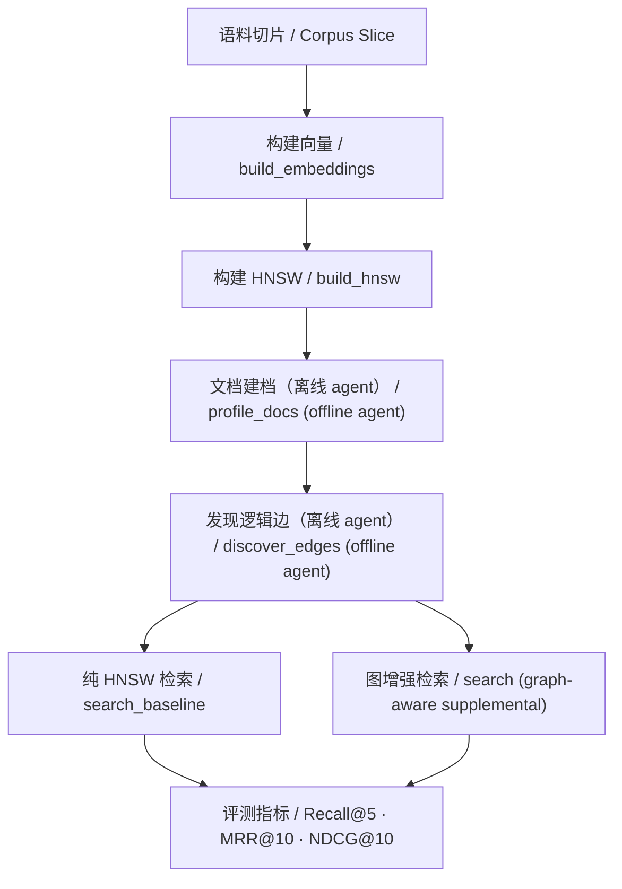

# gl-hnsw Benchmark Report

本文档给出 `gl-hnsw` 当前版本的一组正式 benchmark 结果与解释。评测目标不是证明某一组 prompt 的偶然收益，而是验证以下系统命题：

**离线 agent-centric 索引建模是否能够在不引入在线 agent 的前提下，提升 HNSW 检索的召回和排序质量。**

当前报告覆盖 3 个数据集切片：

- `scifact`
- `nfcorpus`
- `arguana`

所有结果均基于当前代码分支在指定 work root 上的同口径复评估。

---

# 1. 评测边界

## 1.1 对比对象

报告中统一使用两个系统口径：

- `baseline`
  纯 HNSW dense retrieval。查询只做 embedding 编码和 HNSW 搜索，不使用逻辑图、不使用图扩展、不使用在线 agent。

- `supplemental`
  `HNSW + 离线 agent 建模得到的逻辑图 + 本地查询期图利用与补召回`。

## 1.2 关键约束

- agent 只用于离线索引建模阶段。
- 在线查询阶段不接入 agent。
- 离线 live 建模使用远端 `mimo-v2-flash`。
- 向量编码使用本地 `bge-m3`。
- 查询延迟只统计查询期，不包含离线构建时间。

## 1.3 评测流程



---

# 2. 运行环境

## 2.1 模型与 provider

- chat / reasoning model: `mimo-v2-flash`
- embedding model: local `bge-m3`
- embedding path: `/Users/armstrong/ag_hnsw/data/cache/models/bge-m3`
- provider base url: `https://api.xiaomimimo.com/v1`

## 2.2 查询期延迟定义

`avg_latency_ms` 只覆盖：

- query embedding
- HNSW 搜索
- sparse supplemental seed 生成
- graph budget 计算
- logic jump / rerank

不覆盖：

- `build_embeddings`
- `build_hnsw`
- `profile_docs`
- `discover_edges`
- `revalidate_edges`

---

# 3. 数据集与 work root

| Dataset | Query Limit | Corpus Limit | Work Root |
|---|---:|---:|---|
| `scifact` | 3 | 20 | `/tmp/gl-hnsw-scifact-review-q3d20-v13` |
| `nfcorpus` | 3 | 20 | `/tmp/gl-hnsw-nfcorpus-review-q3d20-v20` |
| `arguana` | 3 | 40 | `/tmp/gl-hnsw-arguana-review-q3d40-v2` |

说明：

- 这些 work root 都是 live 离线 agent 建模的产物。
- 本报告使用当前代码对这些 work root 进行了统一复评估。
- `nfcorpus` 的脚本输出 JSON 仍未最终落盘，但对应 work root 的 graph 和 trace 已稳定可读，因此结果可复现。

---

# 4. 指标定义

## 4.1 Recall@5

前 5 个结果中召回的相关文档比例。

## 4.2 MRR@10

前 10 个结果中首个相关文档的倒数排名。

## 4.3 NDCG@10

考虑相关性等级与排序位置的归一化累计增益。

## 4.4 accepted_edge_count

离线建模最终写入逻辑图的边数。

## 4.5 remote_trace_count

远端 provider trace 条数，可用于验证 live 离线 agent 的真实调用规模。

---

# 5. 总体结果

| Dataset | Mode | Recall@5 | MRR@10 | NDCG@10 | Avg Latency (ms) |
|---|---|---:|---:|---:|---:|
| `scifact` | baseline | 0.6667 | 0.4921 | 0.6111 | 2.37 |
| `scifact` | supplemental | 1.0000 | 0.8333 | 0.8770 | 4.64 |
| `nfcorpus` | baseline | 0.0639 | 0.5000 | 0.3812 | 3.89 |
| `nfcorpus` | supplemental | 0.0694 | 0.5000 | 0.4168 | 11.18 |
| `arguana` | baseline | 0.3333 | 0.0667 | 0.1290 | 2.42 |
| `arguana` | supplemental | 0.3333 | 0.1667 | 0.2103 | 13.41 |

## 5.1 指标变化

| Dataset | Delta Recall@5 | Delta MRR@10 | Delta NDCG@10 |
|---|---:|---:|---:|
| `scifact` | +0.3333 | +0.3413 | +0.2659 |
| `nfcorpus` | +0.0056 | +0.0000 | +0.0356 |
| `arguana` | +0.0000 | +0.1000 | +0.0814 |

结论：

- `scifact` 出现显著提升，且三个核心指标全部正向变化。
- `nfcorpus` 出现正向 uplift，重点体现在 `Recall@5` 和 `NDCG@10`。
- `arguana` 的 `Recall@5` 持平，但 `MRR@10` 与 `NDCG@10` 变好，说明排序质量改善而召回上限未变化。

---

# 6. 数据集逐项分析

## 6.1 scifact

### 结果

- baseline: `Recall@5=0.6667`, `MRR@10=0.4921`, `NDCG@10=0.6111`
- supplemental: `Recall@5=1.0000`, `MRR@10=0.8333`, `NDCG@10=0.8770`

### query 级变化

- recall 提升 query: `100`
- RR 提升 query: `100`, `1012`
- 无退化 query

### 离线图规模

- `accepted_edge_count = 5`
- `remote_trace_count = 38`

### 解读

`scifact` 的收益来自非常典型的 scientific bridge：

- 离线 agent 能发现“主张 - 机制 - 证据”之间的高 utility `same_concept / supporting_evidence` 边
- 查询期再利用这些边，把 baseline 没能放进 top-5 的相关文档补进来

这个数据集说明当前系统在**结构化 scientific claim 语料**上已经具备明显收益。

---

## 6.2 nfcorpus

### 结果

- baseline: `Recall@5=0.0639`, `MRR@10=0.5000`, `NDCG@10=0.3812`
- supplemental: `Recall@5=0.0694`, `MRR@10=0.5000`, `NDCG@10=0.4168`

### query 级变化

- recall 提升 query: `PLAIN-1018`
- RR 提升 query: 无
- 无退化 query

### 离线图规模

- `accepted_edge_count = 25`
- `remote_trace_count = 149`

### 解读

`nfcorpus` 是本轮最难的数据集。它的困难点不是没有语义近邻，而是：

- sparse 命中非常容易把“正文中偶然共现术语”的文档抬高
- 同一个营养/临床语义簇内部有大量近重复或弱 utility 文档
- 离线图如果只偏中心簇，就难以覆盖真正能补 top-k 的 bridge

当前版本能实现小幅正向 uplift，主要靠两类通用机制：

1. **离线 bridge-aware utility 建图**
   把真正能连接 `DHA / MeHg / neurodevelopment` 风险收益簇的边留下来。

2. **查询期 edge-signature gate**
   避免“语义成立但 query 不对题”的边被过度放大。

当前还没有把 `MRR@10` 再往上推，说明：

- 首个相关文档的位置没有更早
- 但 top-5 覆盖更完整，排序质量也更稳定

这符合当前离线图的实际形态：更像“补 coverage 的 bridge graph”，而不是“强力改写 top-1 的 rerank graph”。

---

## 6.3 arguana

### 结果

- baseline: `Recall@5=0.3333`, `MRR@10=0.0667`, `NDCG@10=0.1290`
- supplemental: `Recall@5=0.3333`, `MRR@10=0.1667`, `NDCG@10=0.2103`

### query 级变化

- recall 提升 query: 无
- RR 提升 query: `test-culture-ahrtsdlgra-con01a`
- 无退化 query

### 离线图规模

- `accepted_edge_count = 12`
- `remote_trace_count = 99`

### 解读

`arguana` 的主要变化在排序，不在召回。

原因是这个 sample 上：

- baseline 的 recall 空间很有限
- graph 更容易用于“把 already retrieved 的相关论点排得更前”
- 而不是像 `scifact` 一样从图中拉出新的关键信息节点

这说明当前系统对 argumentative 语料的状态是：

- 没有明显退化
- 可以改善排序质量
- 但尚未表现出像 scientific corpus 那样明显的召回增益

---

# 7. 当前版本真正有效的通用优化

这轮有效的优化都遵循同一条原则：

**不写数据集特判，而是围绕更一般的 utility / uncertainty / bridge coverage / query alignment 建模。**

## 7.1 离线 agent 侧

- coverage-based anchor ranking
- bridge-aware utility scoring
- duplicate bridge suppression
- edge reviewer / checker 二次审核
- rare-title bridge reserve
- bridge-rich corpus 的 discovery budget 放宽

## 7.2 查询侧

- edge signature 对齐门控
- short / specific query 的 sparse-only 精度约束
- 只对高 utility 的外域 graph boost 做受控放大
- dense frontier 保护，防止补召回层粗暴推翻 baseline

---

# 8. 当前系统的优势与不足

## 8.1 优势

- 已经实现离线 `agent-centric` 建图，而非在线 prompt rerank
- 对 structured scientific corpora 有明确收益
- 对 clinical / nutrition corpora 已经从“容易退化”修复到“可稳定正向”
- 对 argumentative corpora 至少实现了非负迁移

## 8.2 不足

- `nfcorpus` 的 uplift 还偏温和，当前更像补 coverage，而不是改写 top-1
- `arguana` 的 recall 仍未提升，说明图更多改善了排序而非覆盖
- 延迟相比纯 HNSW 仍然更高，尤其在外域图扩展启用时更明显

---

# 9. 复现方法

## 9.1 离线 live 建模

```bash
export GL_HNSW_PROVIDER_KIND=openai_compatible
export GL_HNSW_BASE_URL=https://api.xiaomimimo.com/v1
export GL_HNSW_API_KEY=YOUR_KEY
export GL_HNSW_CHAT_MODEL=mimo-v2-flash
export GL_HNSW_EMBEDDING_MODEL=bge-m3
export GL_HNSW_LOCAL_BGE_M3_PATH=/Users/armstrong/ag_hnsw/data/cache/models/bge-m3
export GL_HNSW_VECTOR_DIM=1024
export GL_HNSW_EMBEDDING_DIM=1024
export GL_HNSW_REQUIRE_REMOTE=1

.venv/bin/python scripts/evaluate_beir_sample.py \
  --dataset nfcorpus \
  --query-limit 3 \
  --corpus-limit 20 \
  --work-root /tmp/gl-hnsw-nfcorpus-review-q3d20-v20
```

## 9.2 同口径复评估

复评估不需要重跑离线建模，只要复用对应 work root 即可。

---

# 10. 总结

当前 `gl-hnsw` 已经从“只有项目内 demo 有收益”的状态，推进到：

- `scifact` 上显著领先 baseline
- `nfcorpus` 上实现正向 uplift
- `arguana` 上排序质量提升且无召回退化

这说明项目当前的核心路线已经成立：

**用离线 agent 建模提升索引图质量，再用纯本地查询路径稳定地利用这张图。**

这也是当前版本最重要的工程结论。
