# Agent 运行机制说明

## 1. 文档范围

本文说明 `gl-hnsw` 当前真实落地的 agent 运行机制，重点覆盖离线索引建模阶段。

本文不再讨论抽象性的“智能体愿景”，而是基于当前代码实现，说明以下问题：

- 主 agent 与各个 subagent 如何分工
- 它们之间如何发生调用
- 上下文如何在各阶段之间传递
- 记忆如何更新、合并与持久化
- 离线 agent loop 的具体实现逻辑是什么
- 各个 agent 的能力来自哪里
- skills 机制在系统里到底承担什么角色

需要强调的一点是：本项目当前的 agent 核心作用域在**离线索引建模**阶段，而不是在线查询阶段。

---

## 2. 系统定位

`gl-hnsw` 采用的是一种“离线 agent-centric，在线本地执行”的架构。

具体来说：

- 离线阶段：
  - agent 负责文档建档
  - agent 负责候选关系发现
  - agent 负责关系裁决
  - agent 负责边质量复核
  - agent 负责记忆整理
- 在线阶段：
  - 不再默认调用 agent
  - 查询只使用已经构建好的 HNSW 索引、逻辑覆盖图和记忆层

这样设计的原因很明确：

- 离线阶段允许更重的推理、更复杂的结构化判断
- 在线阶段要求稳定、低延迟、易观测、易复现

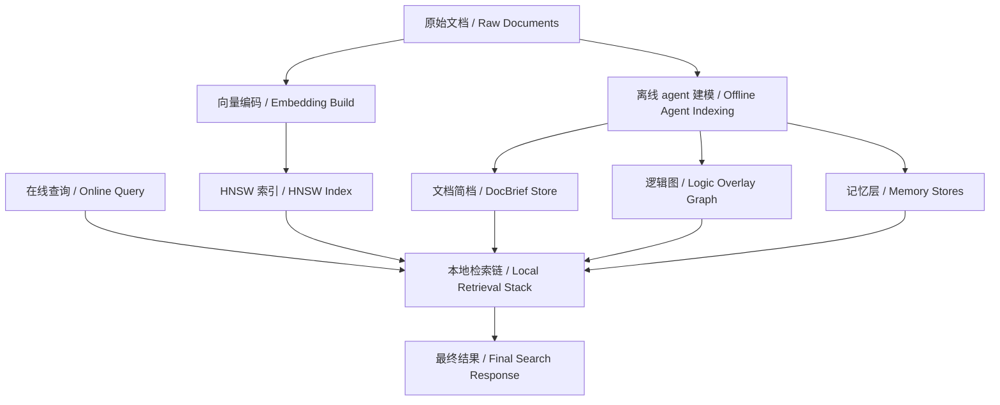

---

## 3. 运行时拓扑

系统的主要装配逻辑位于 [bootstrap.py](/Users/armstrong/gl-hnsw/src/hnsw_logic/app/container.py)。

从运行时视角看，关键对象包括：

- `AgentFactory`
- `LogicOrchestrator`
- `LogicDiscoveryService`
- `BuildPipeline`
- `MemoryCuratorService`
- `HybridRetrievalService`

它们之间的关系如下：

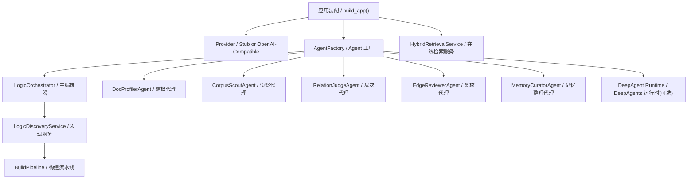

### 3.1 一个必须说明清楚的事实

仓库中确实提供了 `deepagents` 运行时接入，入口仍然在 `AgentFactory.try_create_deep_agent()`。

但当前版本已经不再只是“兼容 deepagents”。离线索引主链已经切换为：

- `BuildPipeline.discover_edges()`
- `OfflineIndexingSupervisor`
- `DeepAgents supervisor`
- 各个 stage subagent
- 最后回到 `LogicOrchestrator` 做 deterministic gate

所以，当前系统最准确的描述是：

- **离线主链由 DeepAgents runtime 驱动**
- **本地 orchestrator 负责最终 signal/gate/commit**
- **在线查询仍然不接入 agent**

---

## 4. Agent 角色划分

当前 subagent 配置定义在 [agents.yaml](/Users/armstrong/gl-hnsw/configs/agents.yaml)。

### 4.1 主 agent：LogicOrchestrator

主 agent 的核心实现位于 [orchestrator.py](/Users/armstrong/gl-hnsw/src/hnsw_logic/agents/orchestrator.py)。

它不是一个简单的调度壳，而是整条离线 agent 流程的总控制器。

它负责：

- 决定哪些 anchor 值得做 discovery
- 对 anchor 做优先级排序
- 调用 scout 获取候选
- 为每个候选构造本地信号包
- 调用 judge 和 reviewer
- 计算 utility、重复惩罚、bridge gain 等本地信号
- 把最终结果转成 `LogicEdge`
- 控制是否允许 retry

### 4.2 各 subagent 的职责

#### DocProfilerAgent

实现文件：
[doc_profiler.py](/Users/armstrong/gl-hnsw/src/hnsw_logic/agents/subagents/doc_profiler.py)

职责：

- 把 `DocRecord` 压缩成 `DocBrief`
- 形成后续所有 agent 阶段共享的语义上下文

#### CorpusScoutAgent

实现文件：
[corpus_scout.py](/Users/armstrong/gl-hnsw/src/hnsw_logic/agents/subagents/corpus_scout.py)

职责：

- 为某个 anchor 提议候选文档
- 输出 `CandidateProposal[]`

#### RelationJudgeAgent

实现文件：
[relation_judge.py](/Users/armstrong/gl-hnsw/src/hnsw_logic/agents/subagents/relation_judge.py)

职责：

- 对 anchor-candidate 对进行关系裁决
- 可以直接运行，也可以读取 `JudgeSignals`
- 输出 `JudgeResult`

#### EdgeReviewerAgent

实现文件：
[edge_reviewer.py](/Users/armstrong/gl-hnsw/src/hnsw_logic/agents/subagents/edge_reviewer.py)

职责：

- 对 judge 的结果做第二轮复核
- 更强调 utility、风险、方向性与证据一致性

#### MemoryCuratorAgent

实现文件：
[memory_curator.py](/Users/armstrong/gl-hnsw/src/hnsw_logic/agents/subagents/memory_curator.py)

职责：

- 基于 accepted / rejected 结果生成 memory payload
- 交给本地 `MemoryCuratorService` 继续合并入持久层

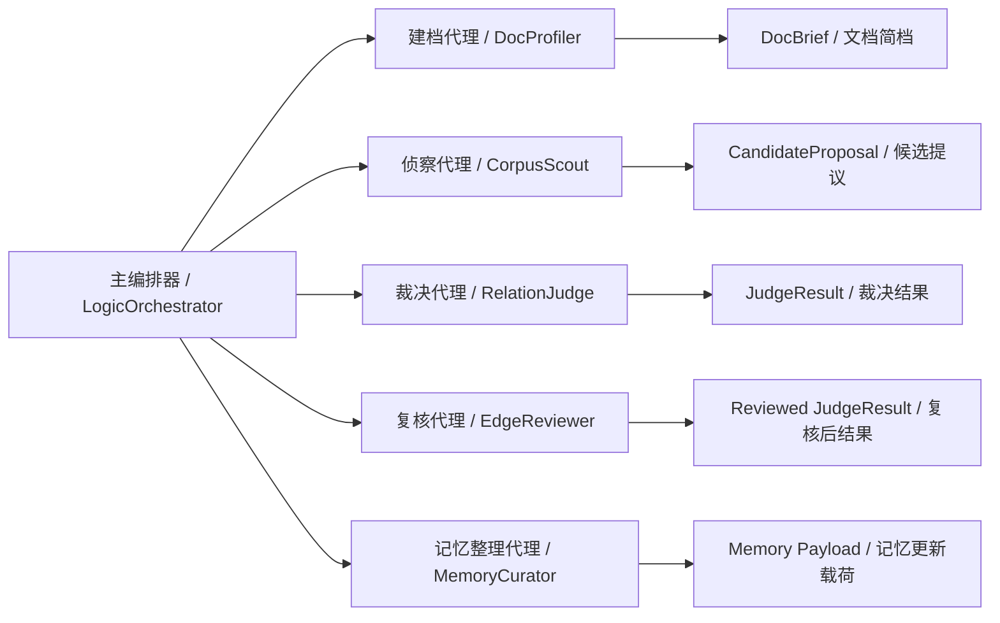

---

## 5. 上下文对象体系

系统的主数据模型定义在 [models.py](/Users/armstrong/gl-hnsw/src/hnsw_logic/domain/models.py)。

### 5.1 核心对象

- `DocRecord`
  - 规范化后的完整文档
- `DocBrief`
  - 供 agent 使用的压缩语义表示
- `CandidateProposal`
  - scout 产出的候选提议
- `JudgeSignals`
  - 本地计算出的 grounded evidence bundle
- `JudgeResult`
  - 模型裁决结果
- `LogicEdge`
  - 最终可落盘的逻辑边
- `AnchorMemory`
  - 单个 anchor 的历史记忆
- `GlobalSemanticMemory`
  - 跨文档可复用的语义记忆

### 5.2 为什么要分成两层上下文

当前系统明确把上下文拆成两类：

#### 语义上下文

主要由 `DocBrief` 提供，包括：

- `title`
- `summary`
- `entities`
- `keywords`
- `claims`
- `relation_hints`

#### 本地 grounded signals

主要由 orchestrator 计算，包括：

- `dense_score`
- `sparse_score`
- `overlap_score`
- `mention_score`
- `direction_score`
- `local_support`
- `utility_score`
- `risk_flags`
- `relation_fit_scores`

这套分层的意义是：

- agent 不是完全靠自由推理在做判断
- 而是基于明确的本地信号与压缩语义上下文做综合决策

这也是当前系统“agent-centric 但不等于 prompt-only”的关键所在。

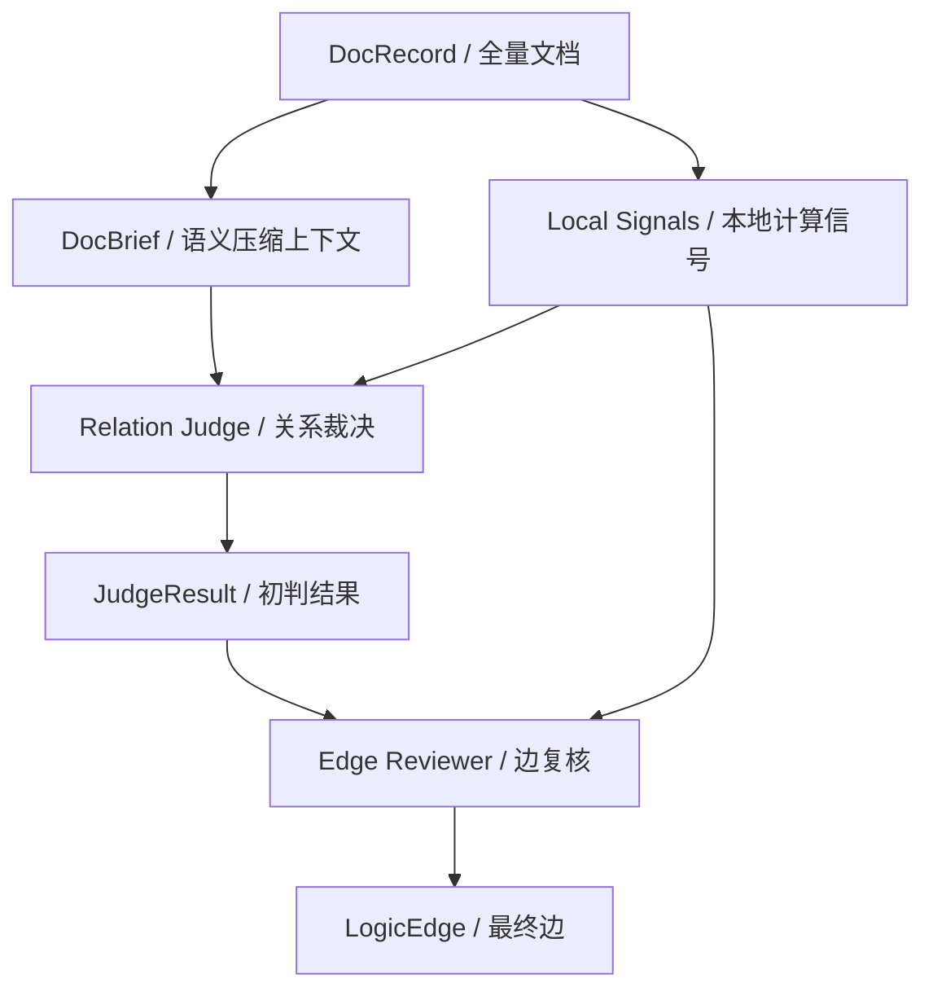

---

## 6. 离线 Agent Loop 的总体结构

离线 agent loop 的实现分散在以下几个文件中：

- [pipeline.py](/Users/armstrong/gl-hnsw/src/hnsw_logic/indexing/pipeline.py)
- [discovery.py](/Users/armstrong/gl-hnsw/src/hnsw_logic/indexing/discovery.py)
- [orchestrator.py](/Users/armstrong/gl-hnsw/src/hnsw_logic/agents/orchestrator.py)

### 6.1 BuildPipeline 的阶段划分

`BuildPipeline` 的标准离线流程包括：

1. `build_embeddings`
2. `build_hnsw`
3. `profile_docs`
4. `discover_edges`
5. `revalidate_edges`

其中：

- 第 1、2 阶段偏索引基础设施
- 第 3、4 阶段是 agent 参与最核心的部分
- 第 5 阶段是图维护阶段

### 6.2 每个 anchor 的 discovery loop

对于每一个被选中的 anchor，离线流程大致如下：

1. 读取 anchor 的 `DocBrief`
2. 调用 scout 找候选
3. 为每个候选构造 `JudgeSignals`
4. 调用 judge
5. 调用 reviewer
6. 生成 accepted `LogicEdge`
7. 写入 graph store
8. 生成 memory payload
9. 合并进 anchor memory 与 semantic memory

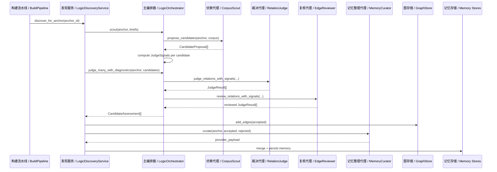

### 6.3 retry 是如何实现的

当前系统支持一次受控 retry，但它不是无限自循环。

在 [discovery.py](/Users/armstrong/gl-hnsw/src/hnsw_logic/indexing/discovery.py) 中，retry 只有在满足以下条件时才发生：

- provider 是 live provider
- 第一轮没有任何 accepted edge
- anchor 的 discovery priority 足够高

此时系统会：

- 以 expanded 模式再做一次 scout
- 对新增候选再做一轮 judge + review

这意味着当前 loop 是：

- 有界的
- 可控的
- 非开放式自治循环

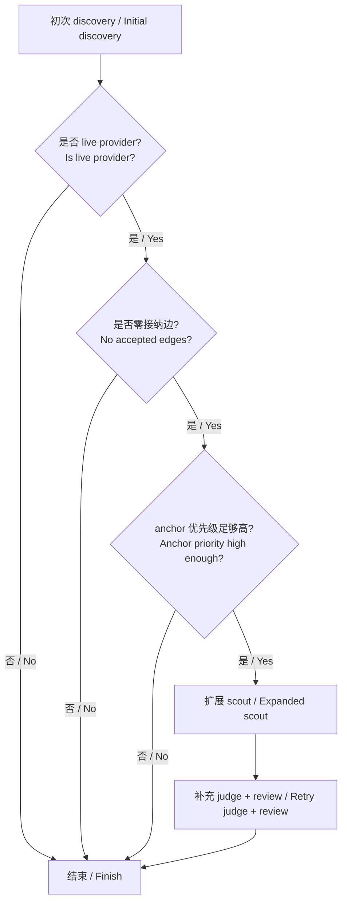

---

## 7. 主 agent 与 subagent 的调用语义

### 7.1 主编排器不是单纯的路由器

当前 `LogicOrchestrator` 的工作量远不止“把请求转发给 subagent”。

它自己就负责大量本地控制逻辑，例如：

- embedding 缓存
- surrogate query term 构造
- bridge information gain 计算
- duplicate penalty 计算
- `JudgeSignals` 组装
- discovery anchor 排序
- candidate 的筛选、截断与重排

因此，当前系统中的职责关系是：

- subagent：负责某一类局部判断
- orchestrator：负责全局控制、证据构造与最终门控

### 7.2 调用流的真实样子

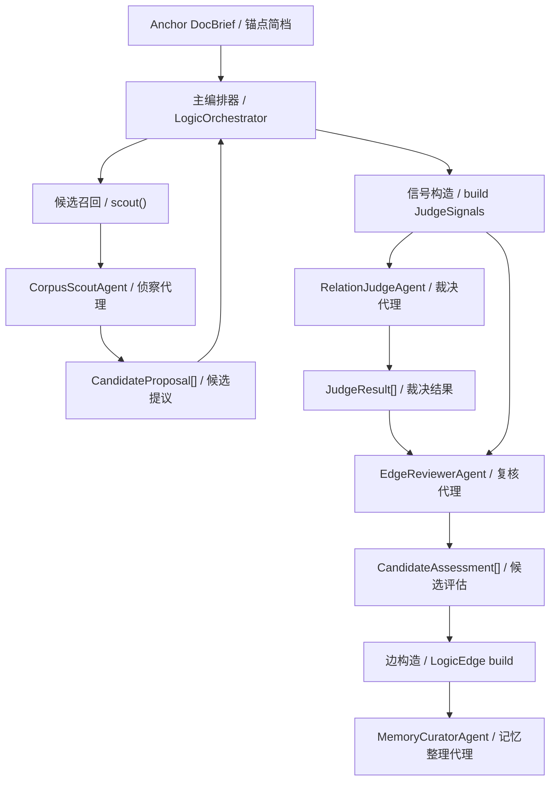

---

## 8. 上下文传递机制

当前系统不是把一个无限增长的 conversation transcript 传来传去。

它采用的是**显式结构化上下文传递**：

- 每个阶段输入固定
- 每个阶段输出固定
- 中间结果通过 typed object 传给下一阶段

### 8.1 Profile 阶段

输入：

- `DocRecord`

输出：

- `DocBrief`

### 8.2 Scout 阶段

输入：

- anchor `DocBrief`
- corpus `DocBrief[]`

输出：

- `CandidateProposal[]`

### 8.3 Judge 阶段

输入：

- anchor `DocBrief`
- candidate `DocBrief`
- `JudgeSignals`

输出：

- `JudgeResult`

### 8.4 Review 阶段

输入：

- anchor `DocBrief`
- candidate `DocBrief`
- `JudgeSignals`
- 初始 `JudgeResult`

输出：

- 复核后的 `JudgeResult`

### 8.5 Curate 阶段

输入：

- anchor `DocBrief`
- accepted `LogicEdge[]`
- rejected doc id 列表

输出：

- provider 侧的 `memory payload`

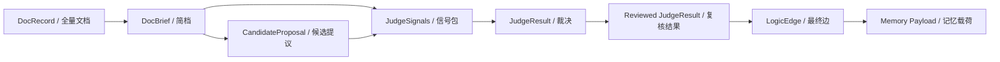

---

## 9. 记忆管理

当前记忆系统是显式文件存储，不是隐藏在 agent 内部状态里的黑盒对话历史。

相关实现位于：

- [anchor_memory.py](/Users/armstrong/gl-hnsw/src/hnsw_logic/storage/memory/anchor_memory.py)
- [semantic_memory.py](/Users/armstrong/gl-hnsw/src/hnsw_logic/storage/memory/semantic_memory.py)
- [graph_memory.py](/Users/armstrong/gl-hnsw/src/hnsw_logic/storage/memory/graph_memory.py)
- [curator.py](/Users/armstrong/gl-hnsw/src/hnsw_logic/storage/memory/curator.py)

### 9.1 AnchorMemory

`AnchorMemory` 保存某个 anchor 的局部运行记忆，包括：

- `explored_docs`
- `rejected_docs`
- `accepted_edge_ids`
- `active_hypotheses`
- `successful_queries`
- `failed_queries`
- `rejection_reasons`
- `top_candidate_scores`
- `accepted_edge_scores`

它本质上是“这个 anchor 在离线 discovery 里已经发生过什么”的记录。

### 9.2 GlobalSemanticMemory

`GlobalSemanticMemory` 保存跨 anchor 可复用的全局模式，包括：

- `canonical_entities`
- `aliases`
- `relation_patterns`
- `rejection_patterns`

它更像系统层面的语义经验库。

### 9.3 GraphMemory

`GraphMemoryStore` 只保存图的系统级统计信息，例如：

- `accepted_edges`
- `last_revalidated_at`

### 9.4 记忆更新链路

`MemoryCuratorAgent` 先给出 provider payload，然后本地 `MemoryCuratorService.merge()` 再把结果合并进持久层。

这意味着：

- agent 负责提出记忆更新建议
- 本地 merge 逻辑负责最终落盘

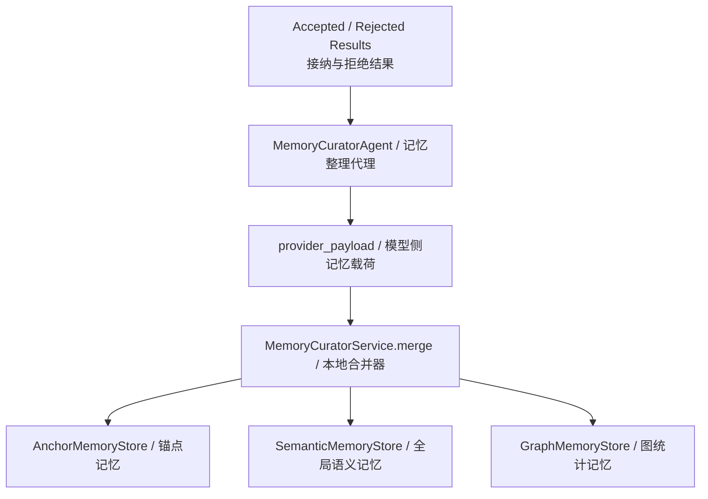

### 9.5 为什么要拆成三层记忆

因为这三类信息的生命周期与作用范围不同：

- anchor memory：
  - 单文档局部状态
  - 强操作性
- semantic memory：
  - 跨文档复用模式
  - 强抽象性
- graph memory：
  - 系统运行统计
  - 强监控属性

这种拆分是当前系统替代“无限 conversation history”的关键工程手段。

---

## 10. Agent Loop 的实现逻辑

当前离线 loop 是一个**受主编排器控制的有限状态循环**。

### 10.1 单个 anchor 的标准循环

1. 选 anchor
2. scout 候选
3. 构造 signals
4. judge
5. review
6. 产出高 utility 边
7. 写图
8. 更新记忆
9. 必要时 retry 一次

### 10.2 为什么它仍然是 agent loop

它仍然属于 agent loop，因为：

- 存在清晰的多角色分工
- 每个角色处理的问题不同
- 各角色由各自 skills 约束行为
- provider 可在各阶段启用远端 reasoning
- 上一阶段输出会成为下一阶段的输入上下文

### 10.3 为什么它不是开放式自治循环

它又不是那种无限自驱动 agent 系统，因为：

- retry 次数有上限
- 边写入必须过 judge + reviewer + orchestrator gate
- memory 写入必须经过本地 merge
- orchestrator 始终掌握最终控制权

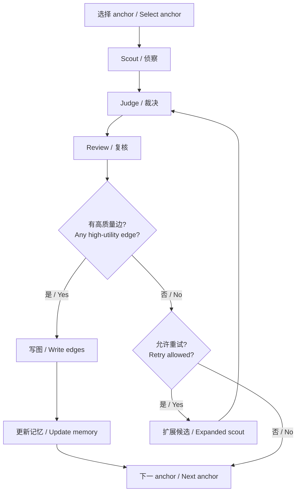

---

## 11. 能力管理：provider、tools、skills 三层

当前系统里的 agent 能力并不是单一来源，而是三层叠加：

- provider 能力
- tool 能力
- skill 能力

### 11.1 Provider 能力

provider 是 agent 真正的执行后端。

例如：

- `profile_doc`
- `propose_candidates`
- `judge_relation_with_signals`
- `review_relation_with_signals`
- `curate_memory`

也就是说，provider 负责：

- 远端 reasoning 调用
- 结构化输出解析
- embedding 调用
- live reasoning 开关控制

### 11.2 Tool 能力

tools registry 定义在 [registry.py](/Users/armstrong/gl-hnsw/src/hnsw_logic/agents/tools/registry.py)。

当前可注册工具包括：

- `search_summaries`
- `lookup_entities`
- `get_hnsw_neighbors`
- `read_doc_brief`
- `read_doc_full`
- `load_anchor_memory`

这些工具的定位是：

- 面向 deepagent runtime 的环境接口
- 以只读检索与上下文装配为主
- 不直接暴露图写入或全局记忆写接口

### 11.3 Skill 能力

canonical runtime skills 存放于 [.deepagents/skills](/Users/armstrong/gl-hnsw/.deepagents/skills)。

当前配置映射为：

- `index_planner`
  - `anchor-planning`
  - `corpus-adaptation`
- `doc_profiler`
  - `doc-briefing`
  - `entity-canonicalization`
- `corpus_scout`
  - `candidate-expansion`
  - `evidence-bundling`
- `relation_judge`
  - `relation-judging`
  - `signal-fusion`
- `counterevidence_checker`
  - `counterevidence-check`
  - `graph-hygiene`
- `edge_reviewer`
  - `edge-utility-review`
  - `graph-hygiene`
- `memory_curator`
  - `memory-summarization`
  - `memory-update`

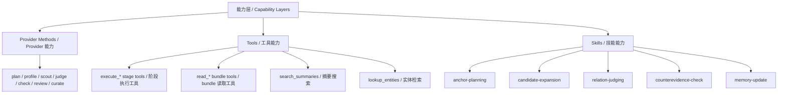

---

## 12. Skills 机制的真实角色

当前系统中，skills 的本质是**行为指导提示**，而不是可执行业务逻辑。

### 12.1 skills 在做什么

skills 主要约束每个角色：

- 优先输出什么结构
- 更看重哪些证据
- 哪些情况应当 abstain
- 应该避免哪类错误

例如：

- `edge_utility`
  - 强调检索价值优先，而不是仅有语义相关
- `signal_fusion`
  - 强调本地信号是 grounded evidence，不是可忽略的 hint
- `relation_typing`
  - 把 canonical relation 限制在固定集合中

### 12.2 skills 不在做什么

skills 不直接负责：

- 持久化写入
- 本地打分代码
- graph write gate
- memory merge
- orchestrator 的最终控制

### 12.3 当前系统里的实际执行模式

当前真实模式可以概括为：

`deepagents supervisor 委派 subagent -> stage tool 产出 bundle -> provider/skills 生成结构化判断 -> orchestrator 做 deterministic gate -> discovery service 落图与记忆合并`

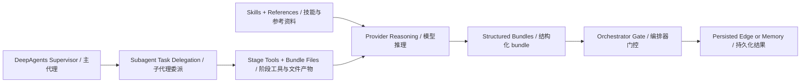

---

## 13. DeepAgents 集成方式

`AgentFactory.try_create_deep_agent()` 会在以下条件都满足时创建 deepagent：

- provider 是 `OpenAICompatibleProvider`
- API key 存在
- deepagents / langchain 相关依赖可导入

创建后的 deepagent 具备：

- `ChatOpenAI` 模型
- canonical skills root
- project memory files
- task delegation subagents
- stage-specific tools
- subagent specs
- `FilesystemBackend`

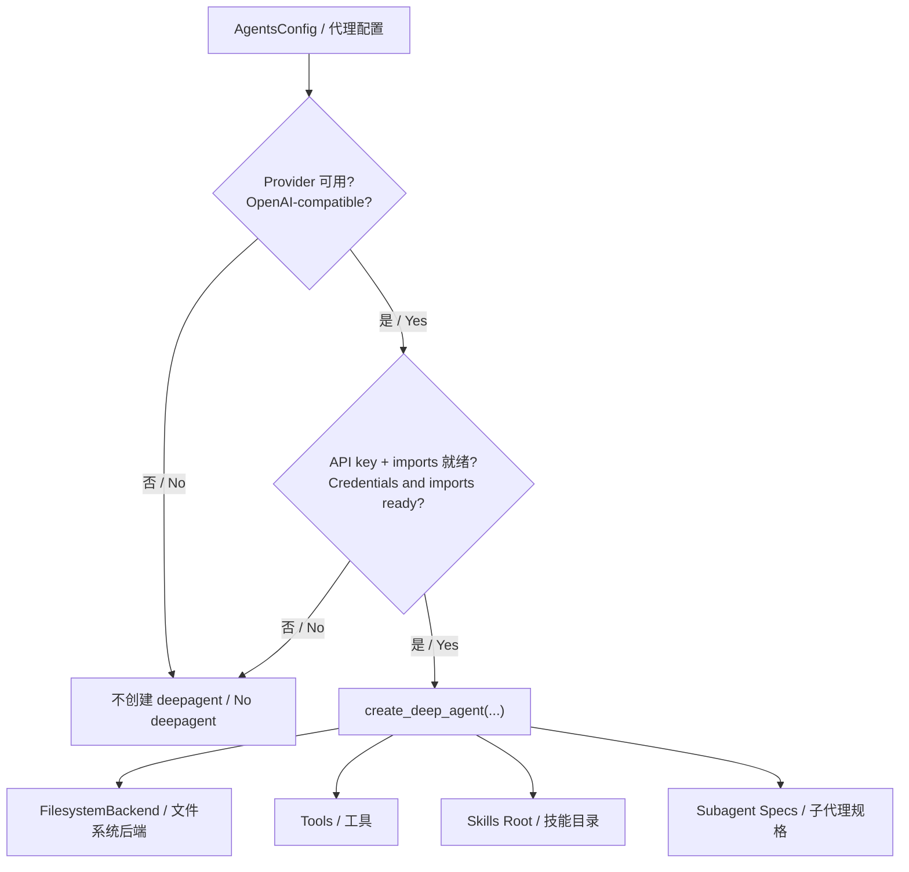

### 13.1 需要正确理解的一点

当前系统并不是“在线和离线都完全交给 deepagents runtime 执行”。

更准确的说法是：

- **离线索引建模** 由 deepagents supervisor 主导
- **在线查询执行** 仍然是纯本地链路
- deepagents 负责 planning、task delegation、filesystem context、skills/memory 调度
- 本地 orchestrator 负责 deterministic gate 与 commit

---

## 14. 风险控制与 guard rails

当前系统为了避免 agent 无约束扩散，内置了多层 guard rails：

- bounded retry
- judge + reviewer 双层判断
- duplicate edge suppression
- mirror edge 只对有限关系开放
- anchor eligibility filtering
- memory merge 走确定性代码

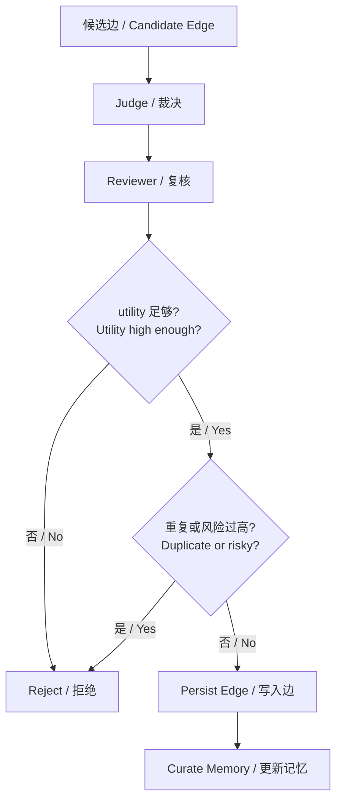

---

## 15. 建议的阅读顺序

如果要按代码执行顺序理解整套 agent 机制，推荐按这个顺序阅读：

1. [bootstrap.py](/Users/armstrong/gl-hnsw/src/hnsw_logic/app/container.py)
2. [pipeline.py](/Users/armstrong/gl-hnsw/src/hnsw_logic/indexing/pipeline.py)
3. [discovery.py](/Users/armstrong/gl-hnsw/src/hnsw_logic/indexing/discovery.py)
4. [orchestrator.py](/Users/armstrong/gl-hnsw/src/hnsw_logic/agents/orchestrator.py)
5. [provider.py](/Users/armstrong/gl-hnsw/src/hnsw_logic/embedding/provider.py)
6. [curator.py](/Users/armstrong/gl-hnsw/src/hnsw_logic/storage/memory/curator.py)
7. [registry.py](/Users/armstrong/gl-hnsw/src/hnsw_logic/agents/tools/registry.py)

这个顺序和真实实现依赖关系是基本一致的。

---

## 16. 总结

当前 `gl-hnsw` 的 agent 运行机制可以概括为：

- 离线优先
- 主编排器控制
- 多 subagent 分工
- 显式结构化上下文传递
- 显式记忆管理
- deepagents 兼容
- 但不依赖无限自治循环

也正因为这样，它既能保持：

- `agent-centric`

又能保持：

- 可控
- 可观测
- 可持久化
- 可作为真实检索索引构建系统运行
